# Open Notebook 架构设计文档

## 1. 项目概述

**Open Notebook** 是一个开源、隐私优先的研究助手，作为 Google Notebook LM 的替代方案。它允许用户管理多模态研究内容并与 AI 模型交互，同时保持对数据的完全控制。

- **版本**: 1.2.2
- **作者**: Luis Novo
- **许可证**: MIT
- **仓库**: https://github.com/lfnovo/open-notebook

### 1.1 核心功能

- 组织多模态内容（PDF、视频、音频、网页）
- 生成专业播客（支持多说话人）
- 智能搜索（全文搜索 + 向量搜索）
- 基于内容上下文的 AI 对话
- AI 辅助笔记与可配置转换
- 支持 16+ AI 提供商（OpenAI、Anthropic、Ollama、Google 等）

### 1.2 设计原则

1. **隐私优先** - 自托管，用户控制数据
2. **简洁胜于功能** - 清晰 UI，合理默认值
3. **API 优先架构** - 所有功能通过 REST API 暴露
4. **多提供商灵活性** - 无供应商锁定

---

## 2. 系统架构总览

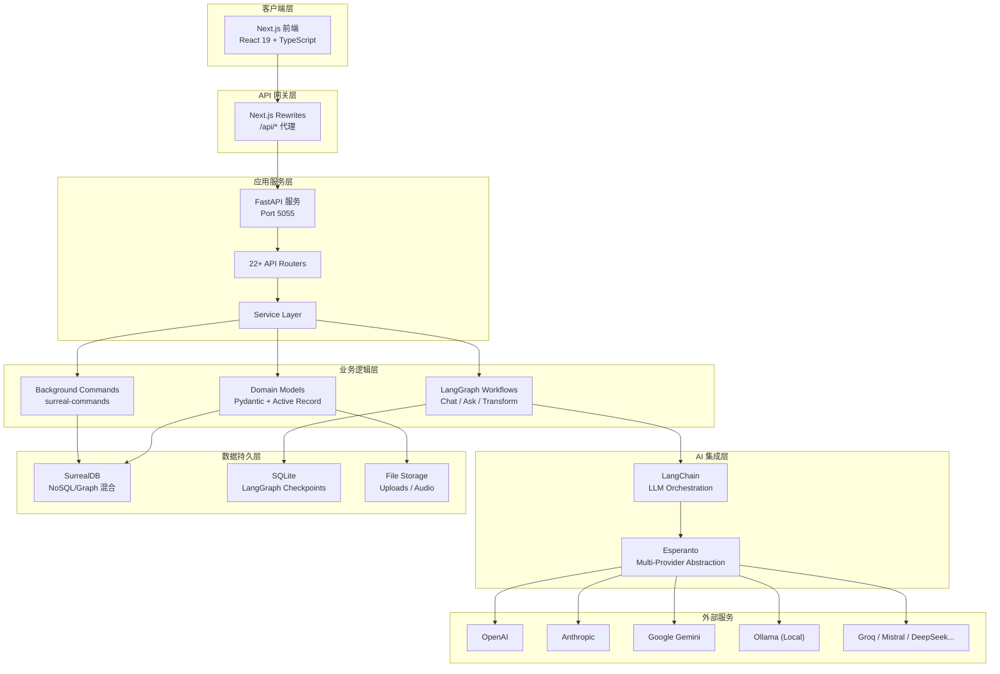

---

## 3. 技术栈详解

### 3.1 后端技术栈

| 类别 | 技术 | 版本 | 用途 |
|------|------|------|------|
| **运行时** | Python | 3.11-3.12 | 主语言 |
| **Web 框架** | FastAPI | ≥0.104.0 | REST API |
| **ASGI 服务器** | Uvicorn | ≥0.24.0 | 异步服务器 |
| **数据验证** | Pydantic | ≥2.9.2 | 模型验证 |
| **LLM 编排** | LangChain | ≥0.3.3 | LLM 集成 |
| **工作流引擎** | LangGraph | ≥0.2.38 | 有状态工作流 |
| **AI 抽象层** | Esperanto | ≥2.8.3 | 多提供商统一接口 |
| **数据库** | SurrealDB | ≥1.0.4 | 文档/图数据库 |
| **后台任务** | surreal-commands | ≥1.2.0 | 异步任务队列 |
| **日志** | Loguru | ≥0.7.2 | 结构化日志 |

### 3.2 前端技术栈

| 类别 | 技术 | 版本 | 用途 |
|------|------|------|------|
| **框架** | Next.js | 15.4.7 | React 元框架 |
| **UI 库** | React | 19.1.0 | 组件库 |
| **类型系统** | TypeScript | ^5 | 类型安全 |
| **状态管理** | Zustand | ^5.0.6 | 客户端状态 |
| **服务端状态** | React Query | ^5.83.0 | 数据获取/缓存 |
| **样式** | Tailwind CSS | ^4 | 原子化 CSS |
| **组件库** | Radix UI | - | 无头组件 |
| **表单** | React Hook Form | ^7.60.0 | 表单处理 |
| **验证** | Zod | ^4.0.5 | Schema 验证 |

### 3.3 基础设施

| 类别 | 技术 | 用途 |
|------|------|------|
| **容器化** | Docker | 多阶段构建 |
| **编排** | Docker Compose | 服务编排 |
| **包管理** | uv | Python 依赖 |
| **进程管理** | Supervisor | 容器内进程 |
| **音视频** | FFmpeg | 媒体处理 |

---

## 4. 后端架构

### 4.1 分层架构

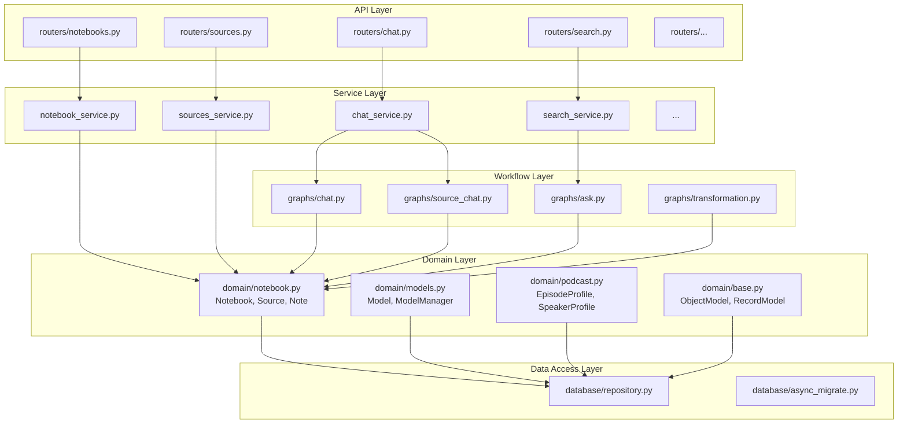

### 4.2 API 路由结构

| 路由模块 | 路径前缀 | 功能 |
|----------|----------|------|
| `auth` | `/api/auth` | 认证状态 |
| `notebooks` | `/api/notebooks` | 笔记本 CRUD |
| `sources` | `/api/sources` | 内容源管理 |
| `notes` | `/api/notes` | 笔记管理 |
| `chat` | `/api/chat` | 对话会话 |
| `source_chat` | `/api/source_chat` | 源上下文对话 |
| `search` | `/api/search` | 全文/向量搜索 |
| `embeddings` | `/api/embed` | 向量嵌入 |
| `transformations` | `/api/transformations` | 内容转换 |
| `insights` | `/api/insights` | AI 洞察生成 |
| `podcasts` | `/api/podcasts` | 播客生成 |
| `models` | `/api/models` | AI 模型管理 |
| `commands` | `/api/commands` | 后台任务 |
| `settings` | `/api/settings` | 系统设置 |

### 4.3 认证机制

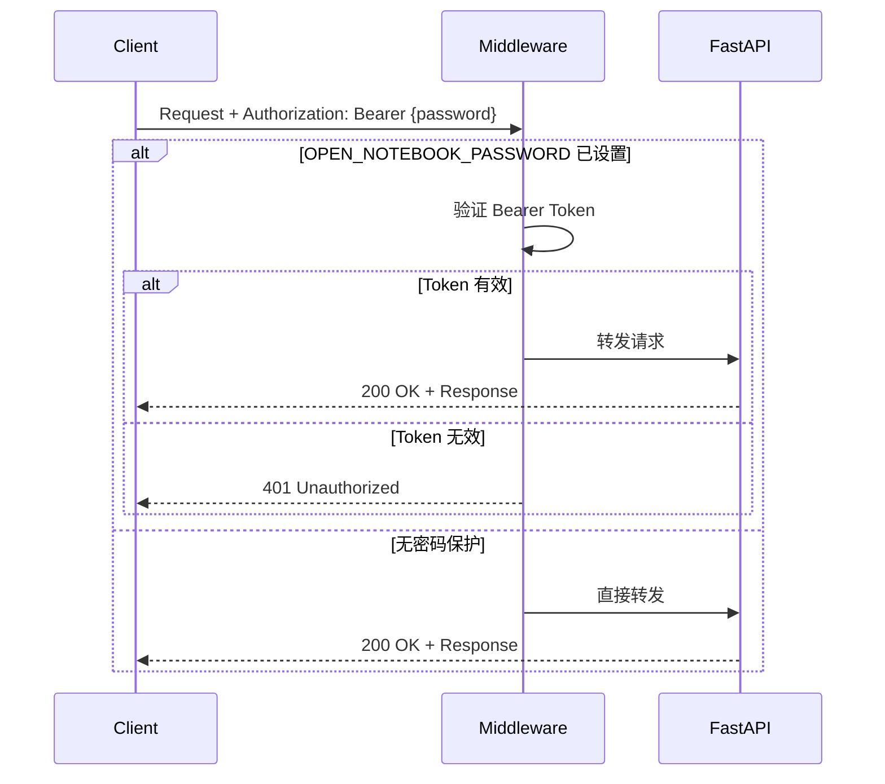

- 基于环境变量 `OPEN_NOTEBOOK_PASSWORD` 的可选密码保护
- 排除路径：`/`, `/health`, `/docs`, `/api/auth/status`, `/api/config`
- Bearer Token 认证方式

---

## 5. 数据模型设计

### 5.1 核心实体关系图

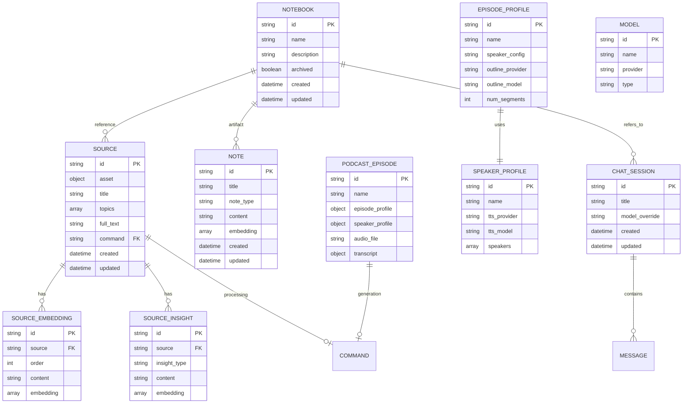

### 5.2 基础模型类

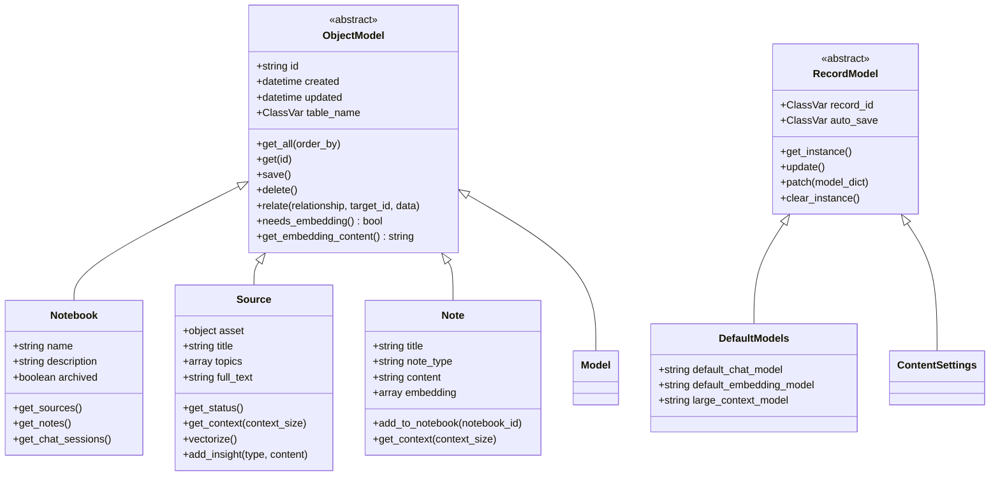

### 5.3 数据库搜索函数

SurrealDB 内置两个搜索函数：

| 函数 | 类型 | 参数 | 返回 |
|------|------|------|------|
| `fn::text_search` | BM25 全文搜索 | query_text, match_count, sources, show_notes | id, title, content, relevance |
| `fn::vector_search` | 余弦相似度 | query, match_count, sources, show_notes, min_similarity | id, title, content, similarity |

---

## 6. LangGraph 工作流

### 6.1 工作流架构

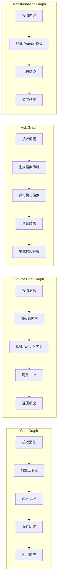

### 6.2 Ask 工作流详解

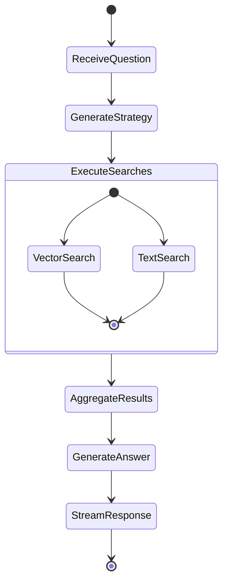

### 6.3 会话状态持久化

- **存储**: SQLite (`./data/sqlite-db/checkpoints.sqlite`)
- **用途**: LangGraph 对话状态检查点
- **特性**: 支持对话恢复和多轮对话

---

## 7. 前端架构

### 7.1 目录结构

```
frontend/src/
├── app/                          # Next.js App Router
│   ├── (auth)/login/            # 登录页
│   ├── (dashboard)/             # 受保护路由
│   │   ├── notebooks/[id]/      # 笔记本详情（三栏布局）
│   │   ├── sources/             # 源管理
│   │   ├── search/              # 全局搜索
│   │   ├── podcasts/            # 播客管理
│   │   ├── models/              # 模型配置
│   │   └── settings/            # 系统设置
│   ├── layout.tsx               # 根布局
│   └── globals.css              # 全局样式
├── components/
│   ├── ui/                      # Radix UI 基础组件
│   ├── layout/                  # 布局组件
│   ├── notebooks/               # 笔记本组件
│   ├── sources/                 # 源组件
│   ├── search/                  # 搜索组件
│   └── podcasts/                # 播客组件
└── lib/
    ├── api/                     # API 客户端
    ├── hooks/                   # 自定义 Hooks
    ├── stores/                  # Zustand 状态
    └── types/                   # TypeScript 类型
```

### 7.2 状态管理架构

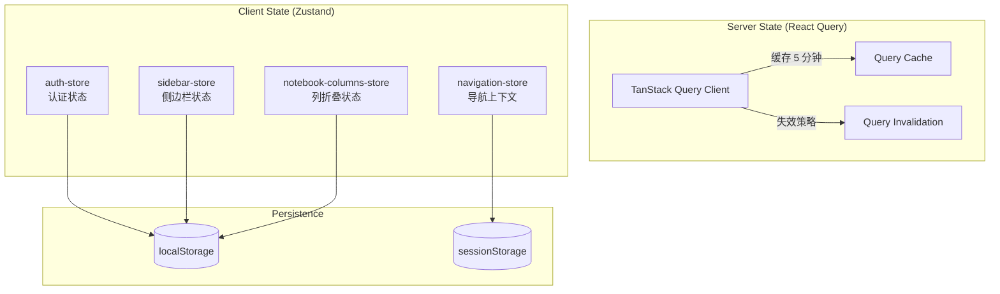

### 7.3 笔记本页面布局

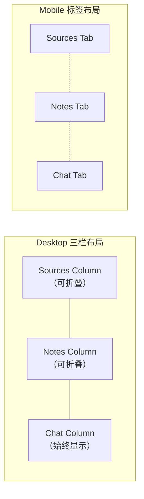

### 7.4 API 通信流程

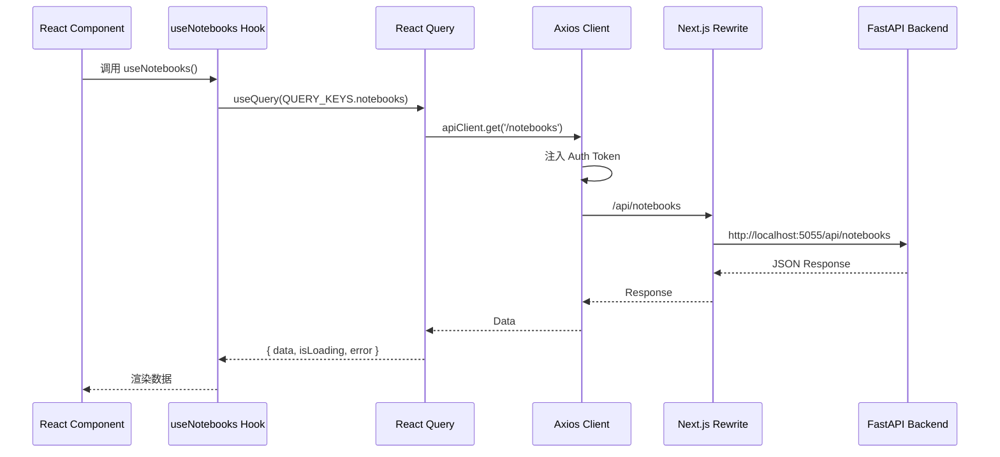

---

## 8. AI 集成架构

### 8.1 多提供商抽象层

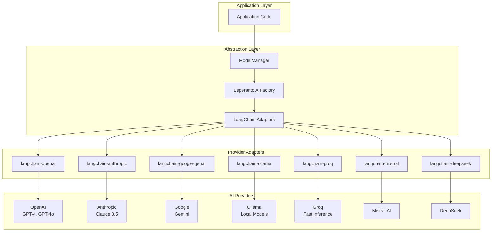

### 8.2 模型类型

| 类型 | 用途 | 示例 |
|------|------|------|
| `language` | 对话/文本生成 | GPT-4o, Claude 3.5 |
| `embedding` | 向量嵌入 | text-embedding-3-small |
| `text_to_speech` | 语音合成 | tts-1, ElevenLabs |
| `speech_to_text` | 语音识别 | whisper-1 |

### 8.3 智能模型选择

```python
# 上下文感知模型选择
def provision_langchain_model(context_tokens, model_override=None):
    if model_override:
        return get_model(model_override)

    if context_tokens > 105_000:
        return get_large_context_model()  # 切换到大上下文模型

    return get_default_chat_model()
```

---

## 9. 后台任务系统

### 9.1 命令模式架构

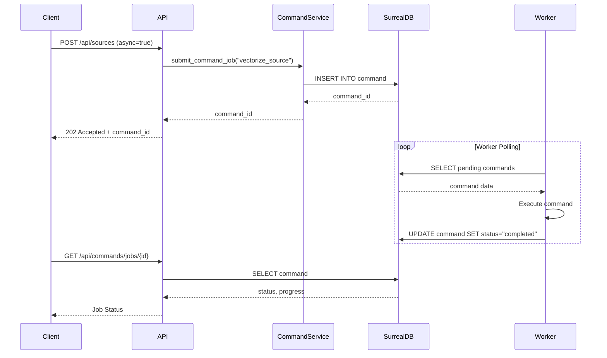

### 9.2 命令类型

| 命令 | 用途 |
|------|------|
| `embed_single_item` | 单项嵌入 |
| `embed_chunk` | 分块嵌入 |
| `vectorize_source` | 源文档向量化 |
| `rebuild_embeddings` | 重建所有嵌入 |
| `generate_podcast` | 播客生成 |
| `process_source` | 源内容处理 |

---

## 10. 部署架构

### 10.1 Docker 部署

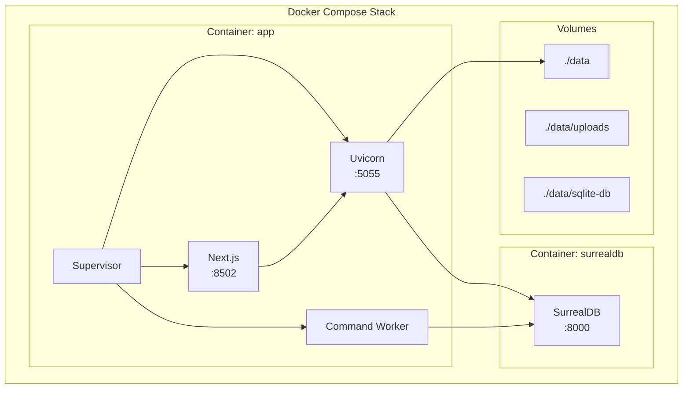

### 10.2 环境变量配置

| 变量 | 默认值 | 用途 |
|------|--------|------|
| `API_HOST` | 127.0.0.1 | API 绑定地址 |
| `API_PORT` | 5055 | API 端口 |
| `SURREAL_URL` | ws://localhost:8000/rpc | SurrealDB 连接 |
| `SURREAL_USER` | root | 数据库用户 |
| `SURREAL_PASSWORD` | - | 数据库密码 |
| `SURREAL_NAMESPACE` | open_notebook | 命名空间 |
| `SURREAL_DATABASE` | production | 数据库名 |
| `OPEN_NOTEBOOK_PASSWORD` | - | API 密码保护 |
| `OPENAI_API_KEY` | - | OpenAI 密钥 |
| `ANTHROPIC_API_KEY` | - | Anthropic 密钥 |

### 10.3 端口映射

| 服务 | 端口 | 协议 |
|------|------|------|
| Next.js 前端 | 8502 | HTTP |
| FastAPI 后端 | 5055 | HTTP |
| SurrealDB | 8000 | WebSocket |

---

## 11. 数据流图

### 11.1 源内容处理流程

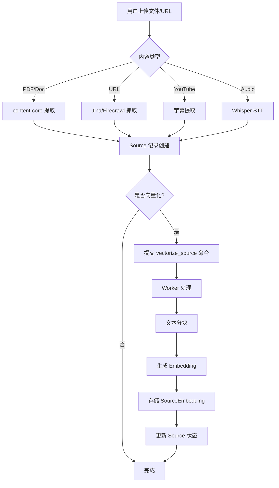

### 11.2 对话处理流程

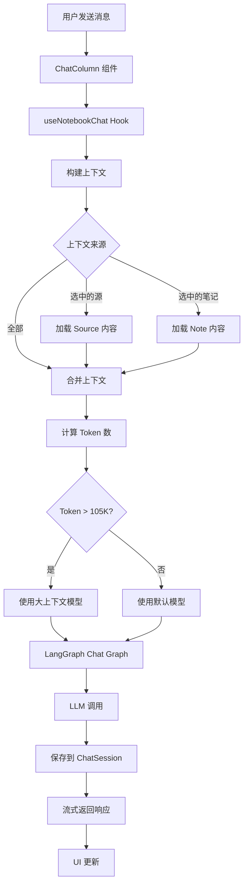

---

## 12. 关键设计模式

### 12.1 Active Record 模式

Domain 模型继承 `ObjectModel`，直接提供数据库操作方法：

```python
class Notebook(ObjectModel):
    table_name = "notebook"
    name: str
    description: str = ""

    async def get_sources(self):
        # 直接在模型上查询关联数据
        return await Source.get_by_notebook(self.id)
```

### 12.2 Repository 模式

底层数据访问封装在 `repository.py`：

```python
async def repo_query(query: str, vars: dict = None):
    async with db_connection() as db:
        return await db.query(query, vars)

async def repo_create(table: str, data: dict):
    return await repo_query(f"CREATE {table} CONTENT $data", {"data": data})
```

### 12.3 工厂模式 (AI 模型)

`ModelManager` 统一管理模型创建：

```python
class ModelManager:
    async def get_model(self, model_id: str, **kwargs):
        # 根据 provider 和 type 创建对应的 LangChain 模型
        return await Esperanto.AIFactory.create(model_id, **kwargs)
```

### 12.4 命令模式 (后台任务)

异步任务通过命令对象解耦：

```python
# 提交命令
command_id = await CommandService.submit_command_job(
    "vectorize_source",
    {"source_id": source.id}
)

# Worker 执行
async def vectorize_source(source_id: str):
    source = await Source.get(source_id)
    chunks = split_text(source.full_text)
    for chunk in chunks:
        embedding = await get_embedding(chunk)
        await SourceEmbedding.create(source=source_id, content=chunk, embedding=embedding)
```

---

## 13. 性能优化策略

### 13.1 前端优化

| 策略 | 实现 |
|------|------|
| 服务端状态缓存 | React Query (stale: 5min, cache: 10min) |
| 客户端状态持久化 | Zustand + localStorage |
| 按需加载 | Next.js App Router 代码分割 |
| 乐观更新 | 本地状态立即更新 |

### 13.2 后端优化

| 策略 | 实现 |
|------|------|
| 异步 I/O | FastAPI + asyncio |
| 连接池 | SurrealDB 异步连接管理 |
| 流式响应 | SSE 流式返回 LLM 响应 |
| 后台处理 | surreal-commands 任务队列 |

### 13.3 AI 优化

| 策略 | 实现 |
|------|------|
| 上下文感知模型选择 | 大上下文自动切换模型 |
| 嵌入缓存 | Token encoder 缓存 |
| 分块处理 | 大文档分块嵌入 |

---

## 14. 安全考虑

### 14.1 认证与授权

- 可选密码保护 (`OPEN_NOTEBOOK_PASSWORD`)
- Bearer Token 认证
- CORS 配置（默认允许所有源，生产环境需限制）

### 14.2 数据安全

- 自托管，数据不离开用户基础设施
- API 密钥通过环境变量管理
- 无外部数据收集

### 14.3 建议改进

- 添加 JWT 认证支持
- 实现用户多租户
- 添加速率限制
- 启用 HTTPS

---

## 15. 总结

Open Notebook 是一个架构清晰、技术栈现代的 AI 研究助手应用：

**架构亮点**:
- 前后端分离，API 优先设计
- 多提供商 AI 抽象层，无供应商锁定
- LangGraph 状态机管理复杂工作流
- SurrealDB 图/文档混合数据库
- 异步任务队列支持长时间操作

**适用场景**:
- 个人/团队知识管理
- 研究内容整理与分析
- AI 辅助写作与总结
- 播客内容生成

**扩展方向**:
- 多用户支持
- 更多内容源类型
- 协作功能
- 移动端应用
