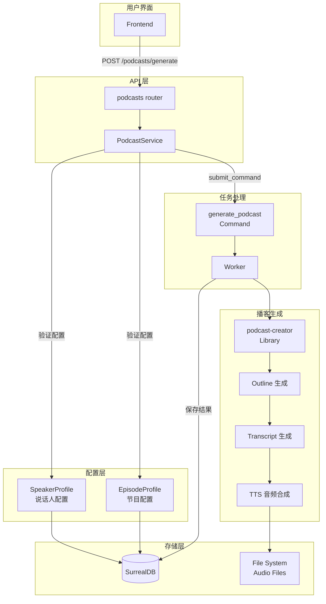
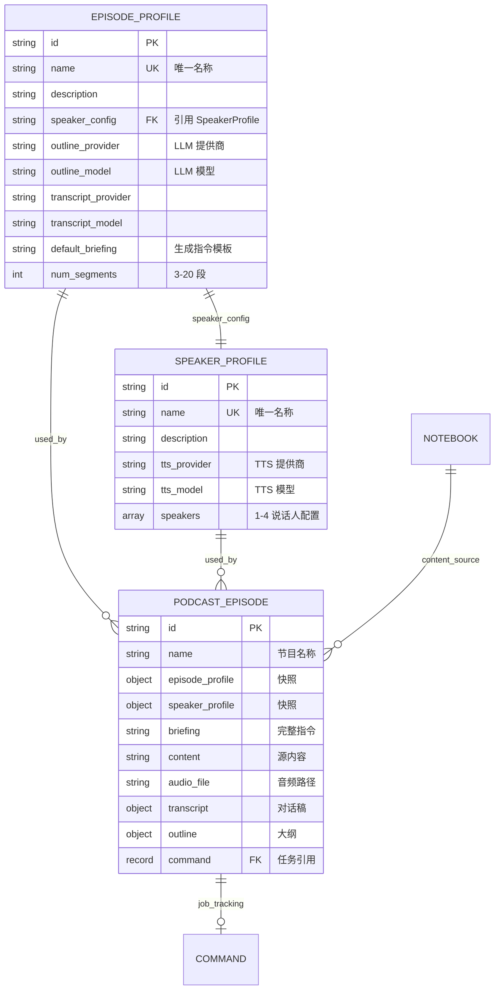
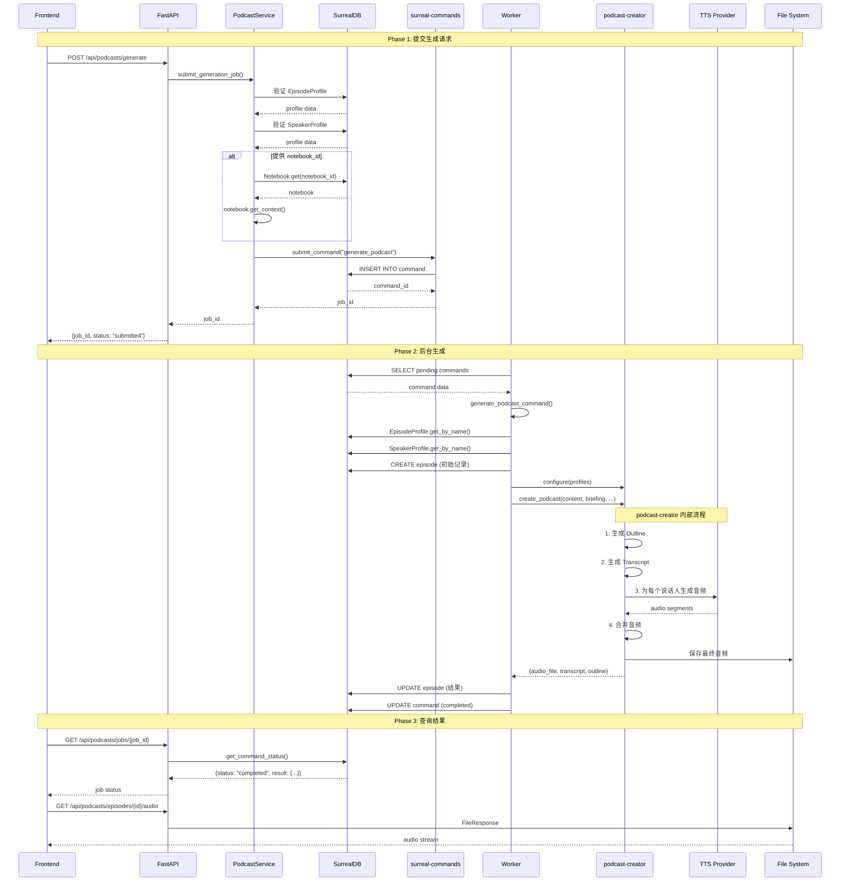
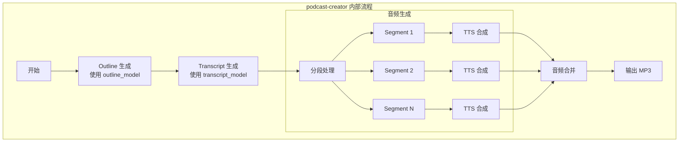
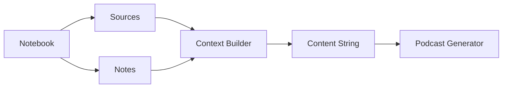
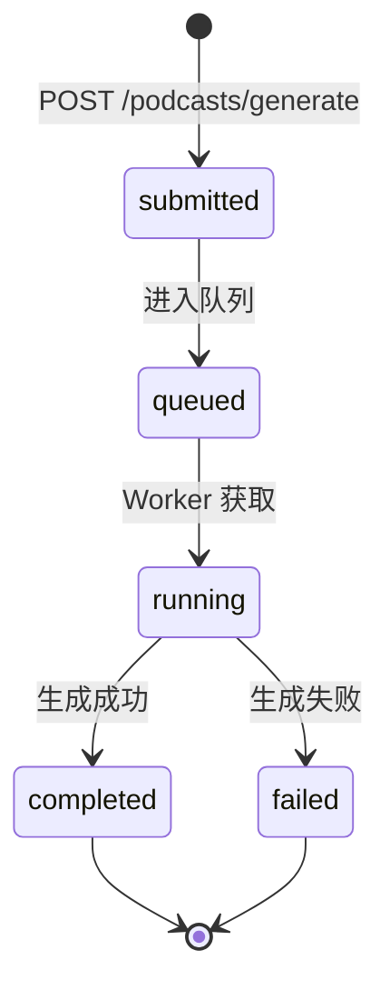
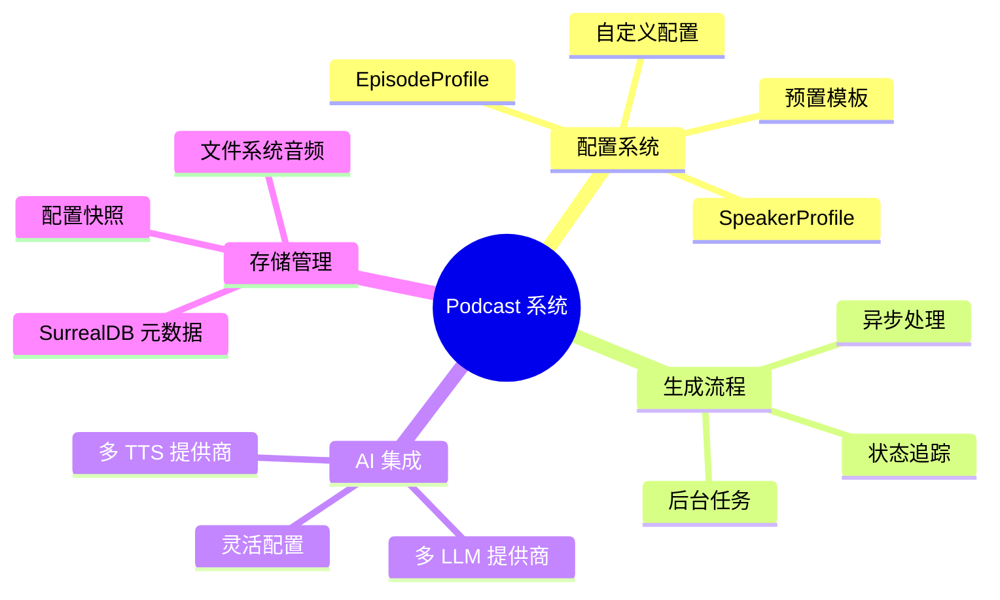

# Open Notebook Podcast 生成系统详解

## 1. 概述

Open Notebook 的播客生成系统将研究内容转换为专业的多说话人播客。与 Google Notebook LM 固定的 2 人格式不同，该系统支持 1-4 位说话人，并提供完整的个性化和语音定制能力。

### 1.1 核心能力

| 功能 | 描述 |
|------|------|
| **多说话人支持** | 1-4 位说话人，支持独白、对话、访谈、圆桌讨论 |
| **配置文件系统** | Episode Profile + Speaker Profile 双重配置 |
| **多 AI 提供商** | OpenAI, Anthropic, Google, Groq, Ollama |
| **多 TTS 提供商** | OpenAI, ElevenLabs, Google TTS, 本地 TTS |
| **后台处理** | 异步生成，不阻塞用户操作 |
| **笔记本集成** | 直接从 Notebook 内容生成播客 |

### 1.2 系统组件



---

## 2. 数据模型

### 2.1 实体关系图



### 2.2 EpisodeProfile（节目配置）

**文件**: `open_notebook/domain/podcast.py`

```python
class EpisodeProfile(ObjectModel):
    """节目配置 - 定义播客的结构和 AI 模型"""

    table_name: ClassVar[str] = "episode_profile"

    name: str                    # 唯一名称
    description: Optional[str]   # 描述
    speaker_config: str          # 引用的 SpeakerProfile 名称
    outline_provider: str        # 大纲生成 LLM 提供商 (openai, anthropic, etc.)
    outline_model: str           # 大纲生成模型 (gpt-4o, claude-3, etc.)
    transcript_provider: str     # 对话稿生成 LLM 提供商
    transcript_model: str        # 对话稿生成模型
    default_briefing: str        # 默认生成指令
    num_segments: int = 5        # 段落数量 (3-20)

    @field_validator("num_segments")
    def validate_segments(cls, v):
        if not 3 <= v <= 20:
            raise ValueError("Number of segments must be between 3 and 20")
        return v

    @classmethod
    async def get_by_name(cls, name: str) -> Optional["EpisodeProfile"]:
        """按名称查询"""
        result = await repo_query(
            "SELECT * FROM episode_profile WHERE name = $name",
            {"name": name}
        )
        return cls(**result[0]) if result else None
```

### 2.3 SpeakerProfile（说话人配置）

```python
class SpeakerProfile(ObjectModel):
    """说话人配置 - 定义语音和个性"""

    table_name: ClassVar[str] = "speaker_profile"

    name: str                       # 唯一名称
    description: Optional[str]      # 描述
    tts_provider: str              # TTS 提供商 (openai, elevenlabs, etc.)
    tts_model: str                 # TTS 模型
    speakers: List[Dict[str, Any]] # 说话人数组 (1-4 人)

    @field_validator("speakers")
    def validate_speakers(cls, v):
        if not 1 <= len(v) <= 4:
            raise ValueError("Must have between 1 and 4 speakers")

        required_fields = ["name", "voice_id", "backstory", "personality"]
        for speaker in v:
            for field in required_fields:
                if field not in speaker:
                    raise ValueError(f"Speaker missing required field: {field}")
        return v
```

**Speaker 对象结构**:

```json
{
    "name": "Dr. Alex Chen",
    "voice_id": "nova",
    "backstory": "Senior AI researcher...",
    "personality": "Analytical, clear communicator..."
}
```

### 2.4 PodcastEpisode（播客节目）

```python
class PodcastEpisode(ObjectModel):
    """播客节目 - 存储生成的播客"""

    table_name: ClassVar[str] = "episode"

    name: str                              # 节目名称
    episode_profile: Dict[str, Any]        # 使用的节目配置（快照）
    speaker_profile: Dict[str, Any]        # 使用的说话人配置（快照）
    briefing: str                          # 完整的生成指令
    content: str                           # 源内容
    audio_file: Optional[str]              # 生成的音频文件路径
    transcript: Optional[Dict[str, Any]]   # 生成的对话稿
    outline: Optional[Dict[str, Any]]      # 生成的大纲
    command: Optional[Union[str, RecordID]] # 关联的后台任务

    async def get_job_status(self) -> Optional[str]:
        """获取任务状态"""
        if not self.command:
            return None
        status = await get_command_status(str(self.command))
        return status.status if status else "unknown"
```

---

## 3. 数据库 Schema

**文件**: `migrations/7.surrealql`

### 3.1 episode_profile 表

```sql
DEFINE TABLE IF NOT EXISTS episode_profile SCHEMAFULL;
DEFINE FIELD IF NOT EXISTS name ON TABLE episode_profile TYPE string;
DEFINE FIELD IF NOT EXISTS description ON TABLE episode_profile TYPE option<string>;
DEFINE FIELD IF NOT EXISTS speaker_config ON TABLE episode_profile TYPE string;
DEFINE FIELD IF NOT EXISTS outline_provider ON TABLE episode_profile TYPE string;
DEFINE FIELD IF NOT EXISTS outline_model ON TABLE episode_profile TYPE string;
DEFINE FIELD IF NOT EXISTS transcript_provider ON TABLE episode_profile TYPE string;
DEFINE FIELD IF NOT EXISTS transcript_model ON TABLE episode_profile TYPE string;
DEFINE FIELD IF NOT EXISTS default_briefing ON TABLE episode_profile TYPE string;
DEFINE FIELD IF NOT EXISTS num_segments ON TABLE episode_profile TYPE int DEFAULT 5;

-- 唯一索引
DEFINE INDEX idx_episode_profile_name
    ON TABLE episode_profile COLUMNS name UNIQUE;
```

### 3.2 speaker_profile 表

```sql
DEFINE TABLE IF NOT EXISTS speaker_profile SCHEMAFULL;
DEFINE FIELD IF NOT EXISTS name ON TABLE speaker_profile TYPE string;
DEFINE FIELD IF NOT EXISTS description ON TABLE speaker_profile TYPE option<string>;
DEFINE FIELD IF NOT EXISTS tts_provider ON TABLE speaker_profile TYPE string;
DEFINE FIELD IF NOT EXISTS tts_model ON TABLE speaker_profile TYPE string;
DEFINE FIELD IF NOT EXISTS speakers ON TABLE speaker_profile TYPE array<object>;

-- 嵌套字段定义
DEFINE FIELD IF NOT EXISTS speakers.*.name ON TABLE speaker_profile TYPE string;
DEFINE FIELD IF NOT EXISTS speakers.*.voice_id ON TABLE speaker_profile TYPE option<string>;
DEFINE FIELD IF NOT EXISTS speakers.*.backstory ON TABLE speaker_profile TYPE option<string>;
DEFINE FIELD IF NOT EXISTS speakers.*.personality ON TABLE speaker_profile TYPE option<string>;

-- 唯一索引
DEFINE INDEX idx_speaker_profile_name
    ON TABLE speaker_profile COLUMNS name UNIQUE;
```

### 3.3 episode 表

```sql
DEFINE TABLE IF NOT EXISTS episode SCHEMAFULL;
DEFINE FIELD IF NOT EXISTS name ON TABLE episode TYPE string;
DEFINE FIELD IF NOT EXISTS briefing ON TABLE episode TYPE option<string>;
DEFINE FIELD IF NOT EXISTS content ON TABLE episode TYPE option<string>;
DEFINE FIELD IF NOT EXISTS audio_file ON TABLE episode TYPE option<string>;

-- FLEXIBLE 类型允许动态对象结构
DEFINE FIELD IF NOT EXISTS episode_profile ON TABLE episode FLEXIBLE TYPE object;
DEFINE FIELD IF NOT EXISTS speaker_profile ON TABLE episode FLEXIBLE TYPE object;
DEFINE FIELD IF NOT EXISTS transcript ON TABLE episode FLEXIBLE TYPE option<object>;
DEFINE FIELD IF NOT EXISTS outline ON TABLE episode FLEXIBLE TYPE option<object>;

-- 关联后台任务
DEFINE FIELD IF NOT EXISTS command ON TABLE episode TYPE option<record<command>>;

-- 索引
DEFINE INDEX idx_episode_command ON TABLE episode COLUMNS command;
```

---

## 4. 预置配置模板

### 4.1 预置 Episode Profiles

| 配置名称 | 说话人数 | 用途 | 段落数 |
|---------|---------|------|-------|
| **tech_discussion** | 2 | 技术讨论 | 5 |
| **solo_expert** | 1 | 专家独白 | 4 |
| **business_analysis** | 3 | 商业分析 | 6 |

#### tech_discussion

```json
{
    "name": "tech_discussion",
    "description": "Technical discussion between 2 experts",
    "speaker_config": "tech_experts",
    "outline_provider": "openai",
    "outline_model": "gpt-5-mini",
    "transcript_provider": "openai",
    "transcript_model": "gpt-5-mini",
    "default_briefing": "Create an engaging technical discussion about the provided content. Focus on practical insights, real-world applications, and detailed explanations that would interest developers and technical professionals.",
    "num_segments": 5
}
```

#### solo_expert

```json
{
    "name": "solo_expert",
    "description": "Single expert explaining complex topics",
    "speaker_config": "solo_expert",
    "outline_provider": "openai",
    "outline_model": "gpt-5-mini",
    "default_briefing": "Create an educational explanation of the provided content. Break down complex concepts into digestible segments, use analogies and examples, and maintain an engaging teaching style.",
    "num_segments": 4
}
```

### 4.2 预置 Speaker Profiles

#### tech_experts (2 人)

```json
{
    "name": "tech_experts",
    "description": "Two technical experts for tech discussions",
    "tts_provider": "openai",
    "tts_model": "gpt-4o-mini-tts",
    "speakers": [
        {
            "name": "Dr. Alex Chen",
            "voice_id": "nova",
            "backstory": "Senior AI researcher and former tech lead at major companies. Specializes in making complex technical concepts accessible.",
            "personality": "Analytical, clear communicator, asks probing questions to dig deeper into technical details"
        },
        {
            "name": "Jamie Rodriguez",
            "voice_id": "alloy",
            "backstory": "Full-stack engineer and tech entrepreneur. Loves practical applications and real-world implementations.",
            "personality": "Enthusiastic, practical-minded, great at explaining implementation details and trade-offs"
        }
    ]
}
```

#### business_panel (3 人)

```json
{
    "name": "business_panel",
    "description": "Business analysis panel with diverse perspectives",
    "tts_provider": "openai",
    "tts_model": "gpt-4o-mini-tts",
    "speakers": [
        {
            "name": "Marcus Thompson",
            "voice_id": "echo",
            "backstory": "Former McKinsey consultant, now startup advisor.",
            "personality": "Strategic thinker, data-driven, excellent at identifying key insights"
        },
        {
            "name": "Elena Vasquez",
            "voice_id": "shimmer",
            "backstory": "Serial entrepreneur and investor.",
            "personality": "Action-oriented, pragmatic, brings startup experience"
        },
        {
            "name": "Johny Bing",
            "voice_id": "ash",
            "backstory": "Youtube celebrity and business mogul.",
            "personality": "Controversial, likes to question ideas and concepts"
        }
    ]
}
```

---

## 5. 播客生成流程

### 5.1 完整流程图



### 5.2 生成命令详解

**文件**: `commands/podcast_commands.py`

```python
@command("generate_podcast", app="open_notebook")
async def generate_podcast_command(
    input_data: PodcastGenerationInput,
) -> PodcastGenerationOutput:
    """使用 podcast-creator 库生成播客"""

    start_time = time.time()

    try:
        # 1. 加载配置
        episode_profile = await EpisodeProfile.get_by_name(input_data.episode_profile)
        speaker_profile = await SpeakerProfile.get_by_name(episode_profile.speaker_config)

        # 2. 构建 briefing
        briefing = episode_profile.default_briefing
        if input_data.briefing_suffix:
            briefing += f"\n\nAdditional instructions: {input_data.briefing_suffix}"

        # 3. 创建 Episode 记录（关联 command）
        episode = PodcastEpisode(
            name=input_data.episode_name,
            episode_profile=episode_profile.model_dump(),
            speaker_profile=speaker_profile.model_dump(),
            command=ensure_record_id(input_data.execution_context.command_id),
            briefing=briefing,
            content=input_data.content,
        )
        await episode.save()

        # 4. 配置 podcast-creator
        episode_profiles_dict = {p["name"]: p for p in await repo_query("SELECT * FROM episode_profile")}
        speaker_profiles_dict = {p["name"]: p for p in await repo_query("SELECT * FROM speaker_profile")}

        configure("speakers_config", {"profiles": speaker_profiles_dict})
        configure("episode_config", {"profiles": episode_profiles_dict})

        # 5. 创建输出目录
        output_dir = Path(f"{DATA_FOLDER}/podcasts/episodes/{input_data.episode_name}")
        output_dir.mkdir(parents=True, exist_ok=True)

        # 6. 生成播客
        result = await create_podcast(
            content=input_data.content,
            briefing=briefing,
            episode_name=input_data.episode_name,
            output_dir=str(output_dir),
            speaker_config=speaker_profile.name,
            episode_profile=episode_profile.name,
        )

        # 7. 更新 Episode 记录
        episode.audio_file = str(result.get("final_output_file_path"))
        episode.transcript = {"transcript": result["transcript"]}
        episode.outline = result["outline"]
        await episode.save()

        return PodcastGenerationOutput(
            success=True,
            episode_id=str(episode.id),
            audio_file_path=episode.audio_file,
            transcript=episode.transcript,
            outline=episode.outline,
            processing_time=time.time() - start_time,
        )

    except Exception as e:
        return PodcastGenerationOutput(
            success=False,
            processing_time=time.time() - start_time,
            error_message=str(e),
        )
```

### 5.3 podcast-creator 库集成



**Outline 生成**：
- 使用 `outline_provider` + `outline_model` 生成对话大纲
- 确定主题、段落结构、每段的讨论重点

**Transcript 生成**：
- 使用 `transcript_provider` + `transcript_model` 生成完整对话稿
- 根据说话人的 backstory 和 personality 生成自然对话
- 包含说话人标记、对话内容

**音频合成**：
- 使用 `tts_provider` + `tts_model` 将对话稿转为语音
- 每位说话人使用其配置的 `voice_id`
- 支持并发处理（`TTS_BATCH_SIZE`）

---

## 6. API 接口

### 6.1 生成播客

```http
POST /api/podcasts/generate
Content-Type: application/json

{
    "episode_profile": "tech_discussion",
    "speaker_profile": "tech_experts",
    "episode_name": "AI Trends 2024",
    "content": "...",              // 直接提供内容
    "notebook_id": "notebook:xxx", // 或从笔记本获取
    "briefing_suffix": "Focus on practical applications"
}
```

**响应**：
```json
{
    "job_id": "command:abc123",
    "status": "submitted",
    "message": "Podcast generation started for episode 'AI Trends 2024'",
    "episode_profile": "tech_discussion",
    "episode_name": "AI Trends 2024"
}
```

### 6.2 查询任务状态

```http
GET /api/podcasts/jobs/{job_id}
```

**响应**：
```json
{
    "job_id": "command:abc123",
    "status": "completed",
    "result": {
        "success": true,
        "episode_id": "episode:xyz789",
        "audio_file_path": "/data/podcasts/episodes/AI Trends 2024/final.mp3",
        "processing_time": 120.5
    },
    "error_message": null
}
```

### 6.3 获取节目列表

```http
GET /api/podcasts/episodes
```

**响应**：
```json
[
    {
        "id": "episode:xyz789",
        "name": "AI Trends 2024",
        "episode_profile": {...},
        "speaker_profile": {...},
        "briefing": "...",
        "audio_file": "/data/podcasts/episodes/AI Trends 2024/final.mp3",
        "audio_url": "/api/podcasts/episodes/episode:xyz789/audio",
        "transcript": {...},
        "outline": {...},
        "created": "2024-01-15T10:30:00Z",
        "job_status": "completed"
    }
]
```

### 6.4 播放音频

```http
GET /api/podcasts/episodes/{episode_id}/audio
```

**响应**：`FileResponse` (audio/mpeg)

### 6.5 删除节目

```http
DELETE /api/podcasts/episodes/{episode_id}
```

---

## 7. 配置管理 API

### 7.1 Episode Profiles

| 方法 | 路径 | 描述 |
|------|------|------|
| GET | `/episode-profiles` | 列出所有配置 |
| GET | `/episode-profiles/{name}` | 按名称获取 |
| POST | `/episode-profiles` | 创建新配置 |
| PUT | `/episode-profiles/{id}` | 更新配置 |
| DELETE | `/episode-profiles/{id}` | 删除配置 |
| POST | `/episode-profiles/{id}/duplicate` | 复制配置 |

### 7.2 Speaker Profiles

| 方法 | 路径 | 描述 |
|------|------|------|
| GET | `/speaker-profiles` | 列出所有配置 |
| GET | `/speaker-profiles/{name}` | 按名称获取 |
| POST | `/speaker-profiles` | 创建新配置 |
| PUT | `/speaker-profiles/{id}` | 更新配置 |
| DELETE | `/speaker-profiles/{id}` | 删除配置 |
| POST | `/speaker-profiles/{id}/duplicate` | 复制配置 |

---

## 8. 内容来源

### 8.1 从 Notebook 获取内容



**代码流程** (`podcast_service.py`):

```python
async def submit_generation_job(
    episode_profile_name: str,
    speaker_profile_name: str,
    episode_name: str,
    notebook_id: Optional[str] = None,
    content: Optional[str] = None,
    briefing_suffix: Optional[str] = None,
) -> str:
    # 如果未直接提供 content，从 notebook 获取
    if not content and notebook_id:
        notebook = await Notebook.get(notebook_id)
        content = (
            await notebook.get_context()
            if hasattr(notebook, "get_context")
            else str(notebook)
        )

    if not content:
        raise ValueError("Content is required")

    # 提交生成任务...
```

### 8.2 直接提供内容

用户可以直接在 API 请求中提供 `content` 字段，跳过从 Notebook 获取内容的步骤。

---

## 9. TTS 提供商配置

### 9.1 支持的 TTS 提供商

| 提供商 | 特点 | 推荐 Batch Size |
|--------|------|-----------------|
| **OpenAI TTS** | 高质量，多种声音 | 5 |
| **ElevenLabs** | 专业级，语音克隆 | 2 |
| **Google TTS** | 多语言支持 | 4 |
| **Local TTS** | 免费，隐私 | 1 |

### 9.2 OpenAI 声音选项

| Voice ID | 特点 |
|----------|------|
| `nova` | 清晰，适合教育内容 |
| `alloy` | 自然，适合对话 |
| `echo` | 沉稳，适合商业 |
| `fable` | 故事性强 |
| `onyx` | 深沉，权威感 |
| `shimmer` | 明亮，活泼 |

### 9.3 并发控制

```bash
# 环境变量配置
export TTS_BATCH_SIZE=3  # 并发 TTS 请求数
```

---

## 10. 文件存储

### 10.1 目录结构

```
$DATA_FOLDER/
└── podcasts/
    └── episodes/
        └── {episode_name}/
            ├── final.mp3           # 最终音频
            ├── segment_001.mp3     # 分段音频
            ├── segment_002.mp3
            └── ...
```

### 10.2 音频流播放

```python
@router.get("/podcasts/episodes/{episode_id}/audio")
async def stream_podcast_episode_audio(episode_id: str):
    episode = await PodcastService.get_episode(episode_id)

    if not episode.audio_file:
        raise HTTPException(status_code=404, detail="Episode has no audio file")

    audio_path = _resolve_audio_path(episode.audio_file)

    return FileResponse(
        audio_path,
        media_type="audio/mpeg",
        filename=audio_path.name,
    )
```

---

## 11. 任务状态追踪

### 11.1 状态流转



### 11.2 Episode 与 Command 关联

```python
class PodcastEpisode(ObjectModel):
    command: Optional[Union[str, RecordID]]  # 关联 surreal-commands 任务

    async def get_job_status(self) -> Optional[str]:
        """查询关联任务的状态"""
        if not self.command:
            return None
        status = await get_command_status(str(self.command))
        return status.status if status else "unknown"
```

---

## 12. 最佳实践

### 12.1 内容准备

| 建议 | 说明 |
|------|------|
| 内容量 | 1000+ 字以获得丰富讨论 |
| 主题明确 | 清晰的主题产生更好的对话 |
| 多样性 | 多角度的内容使讨论更有深度 |

### 12.2 配置选择

| 场景 | 推荐配置 |
|------|----------|
| 技术教程 | `tech_discussion` (2人讨论) |
| 概念讲解 | `solo_expert` (单人独白) |
| 商业分析 | `business_analysis` (圆桌讨论) |

### 12.3 性能优化

```bash
# 高性能服务器
export TTS_BATCH_SIZE=5

# 受限环境或严格限流的提供商
export TTS_BATCH_SIZE=2
```

---

## 13. 总结

### 13.1 系统架构优势



### 13.2 与 Google Notebook LM 对比

| 功能 | Open Notebook | Google Notebook LM |
|------|---------------|-------------------|
| 说话人数量 | 1-4 | 固定 2 |
| 声音定制 | 多 TTS 提供商 | 固定 |
| 个性定制 | 完整 backstory/personality | 有限 |
| 本地处理 | 支持 Ollama + Local TTS | 仅云端 |
| 集成方式 | 无缝笔记本集成 | 独立工具 |
