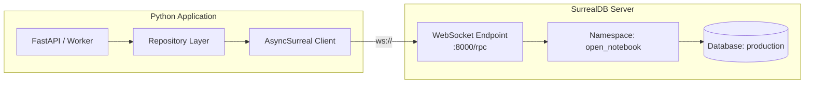
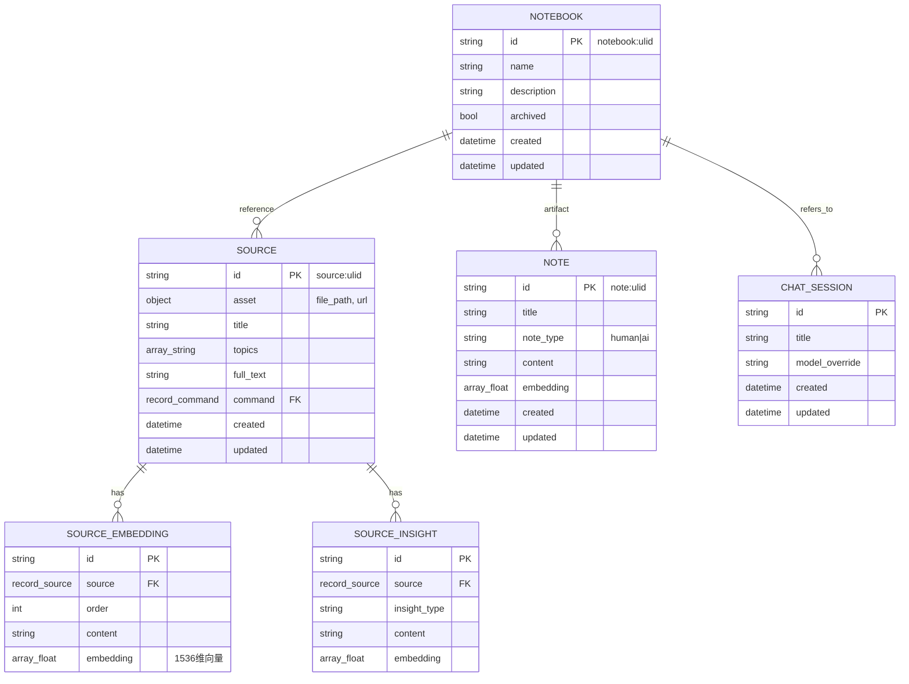
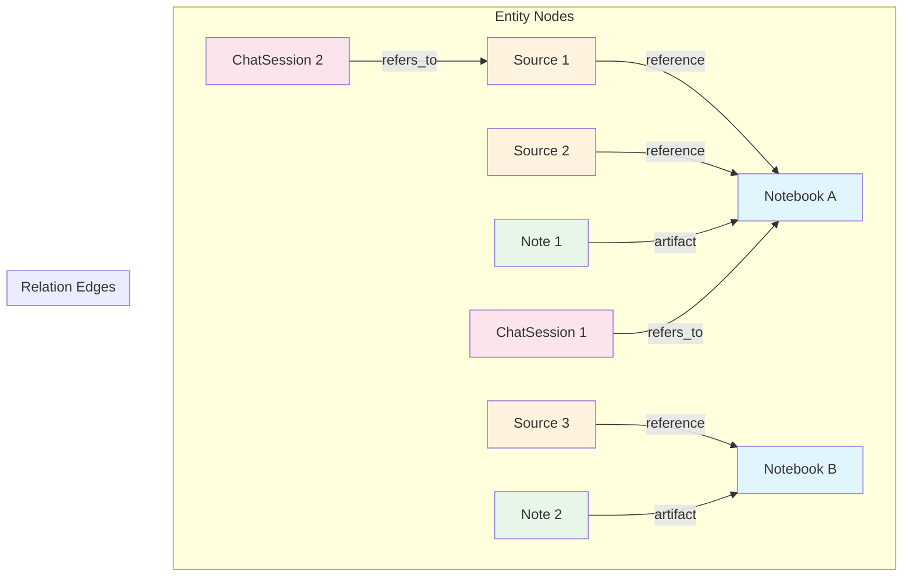
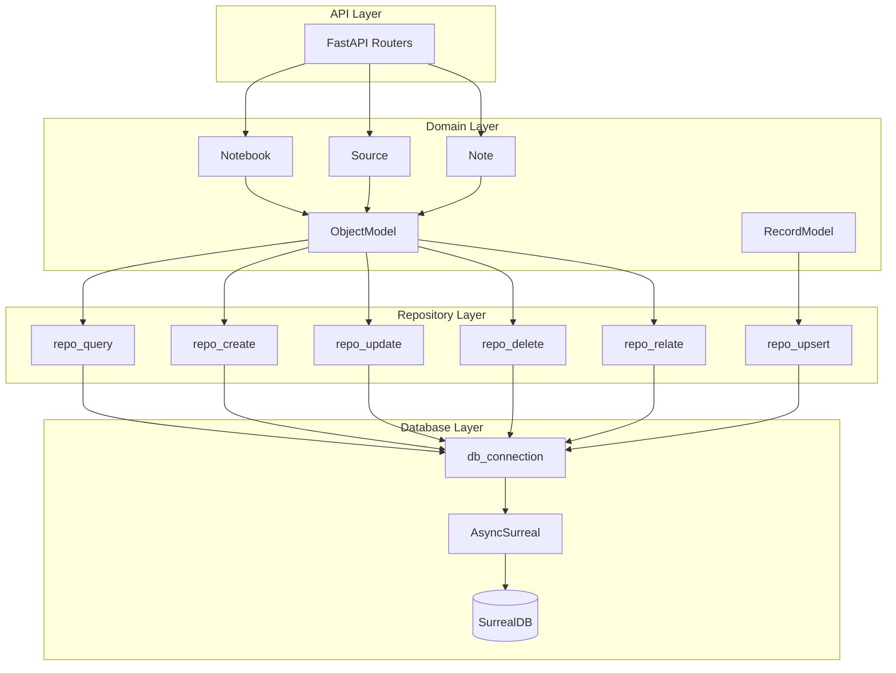
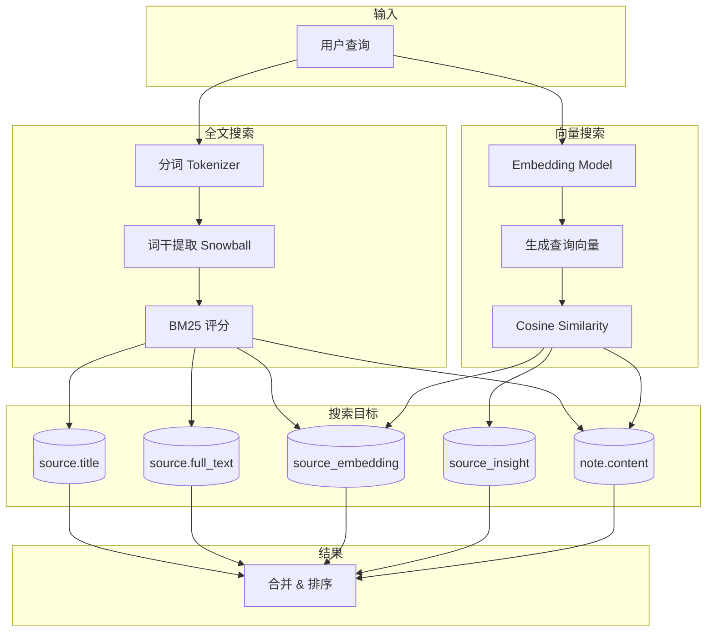
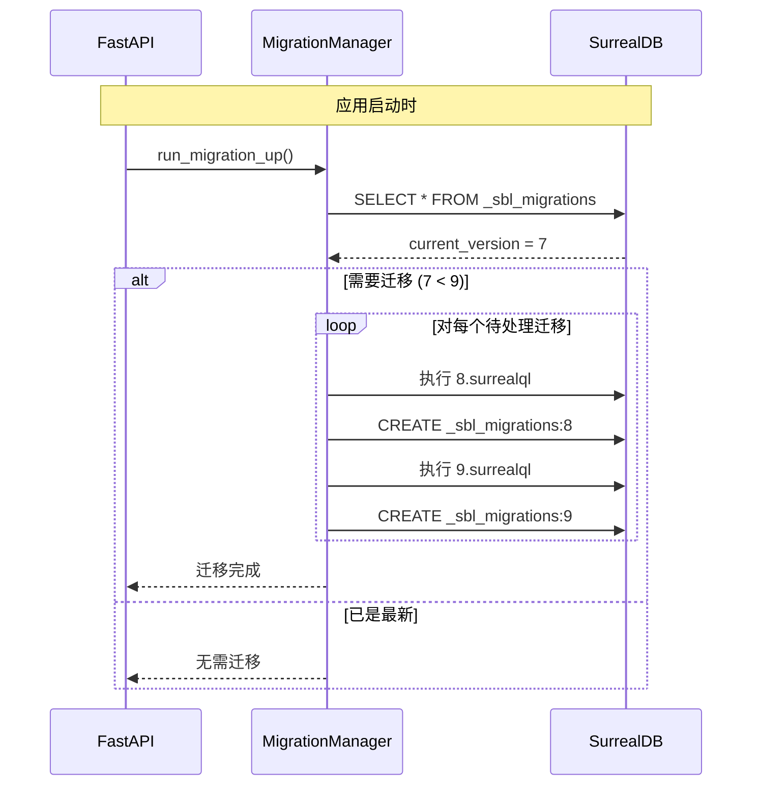
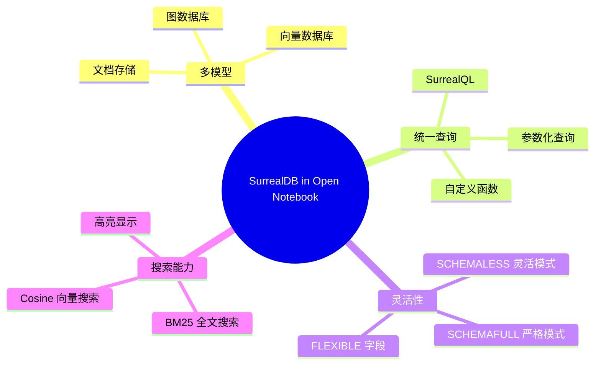

# Open Notebook 与 SurrealDB 集成详解

## 1. 概述

Open Notebook 使用 SurrealDB 作为其核心数据存储，充分利用了 SurrealDB 的多模型特性：

- **文档存储**：存储笔记、源文档、配置等结构化数据
- **图数据库**：管理笔记本、源、笔记之间的关系
- **向量搜索**：支持语义搜索（cosine similarity）
- **全文搜索**：BM25 算法的关键词搜索

### 1.1 技术栈

| 组件 | 版本 | 用途 |
|------|------|------|
| SurrealDB Server | 1.x | 数据库服务 |
| surrealdb (Python) | ≥1.0.4 | 异步客户端 SDK |
| WebSocket | ws:// | 连接协议 |

---

## 2. 数据库连接

### 2.1 连接配置

**文件**: `open_notebook/database/repository.py`

```python
from surrealdb import AsyncSurreal, RecordID

def get_database_url():
    """获取数据库 URL（支持向后兼容）"""
    surreal_url = os.getenv("SURREAL_URL")
    if surreal_url:
        return surreal_url
    # 回退到旧格式
    address = os.getenv("SURREAL_ADDRESS", "localhost")
    port = os.getenv("SURREAL_PORT", "8000")
    return f"ws://{address}/rpc:{port}"

@asynccontextmanager
async def db_connection():
    """异步上下文管理器：管理数据库连接"""
    db = AsyncSurreal(get_database_url())
    await db.signin({
        "username": os.environ.get("SURREAL_USER"),
        "password": get_database_password(),
    })
    await db.use(
        os.environ.get("SURREAL_NAMESPACE"),
        os.environ.get("SURREAL_DATABASE")
    )
    try:
        yield db
    finally:
        await db.close()
```

### 2.2 环境变量

```bash
# .env 文件
SURREAL_URL="ws://localhost:8000/rpc"    # WebSocket 连接 URL
SURREAL_USER="root"                       # 用户名
SURREAL_PASSWORD="root"                   # 密码
SURREAL_NAMESPACE="open_notebook"         # 命名空间
SURREAL_DATABASE="production"             # 数据库名
```

### 2.3 连接架构图



---

## 3. 数据模型定义

### 3.1 表定义语法

SurrealDB 使用 SurrealQL 定义表结构：

```sql
-- SCHEMAFULL: 严格模式，只允许定义的字段
DEFINE TABLE IF NOT EXISTS source SCHEMAFULL;

-- SCHEMALESS: 灵活模式，允许任意字段
DEFINE TABLE IF NOT EXISTS chat_session SCHEMALESS;
```

### 3.2 字段类型

| SurrealQL 类型 | 说明 | 示例 |
|---------------|------|------|
| `string` | 字符串 | `TYPE string` |
| `int` | 整数 | `TYPE int` |
| `bool` | 布尔值 | `TYPE bool DEFAULT false` |
| `float` | 浮点数 | `TYPE float` |
| `array<T>` | 数组 | `TYPE array<string>` |
| `array<float>` | 向量 | `TYPE array<float>` (嵌入向量) |
| `object` | 嵌套对象 | `TYPE object` |
| `option<T>` | 可选类型 | `TYPE option<string>` |
| `record<T>` | 外键引用 | `TYPE record<source>` |
| `datetime` | 时间戳 | 使用 `time::now()` |

### 3.3 核心表结构



### 3.4 表定义示例

**Migration 1: 核心表** (`migrations/1.surrealql`)

```sql
-- Source 表（严格模式）
DEFINE TABLE IF NOT EXISTS source SCHEMAFULL;
DEFINE FIELD IF NOT EXISTS asset ON TABLE source FLEXIBLE TYPE option<object>;
DEFINE FIELD IF NOT EXISTS title ON TABLE source TYPE option<string>;
DEFINE FIELD IF NOT EXISTS topics ON TABLE source TYPE option<array<string>>;
DEFINE FIELD IF NOT EXISTS full_text ON TABLE source TYPE option<string>;
DEFINE FIELD IF NOT EXISTS created ON source DEFAULT time::now() VALUE $before OR time::now();
DEFINE FIELD IF NOT EXISTS updated ON source DEFAULT time::now() VALUE time::now();

-- Source Embedding 表（向量存储）
DEFINE TABLE IF NOT EXISTS source_embedding SCHEMAFULL;
DEFINE FIELD IF NOT EXISTS source ON TABLE source_embedding TYPE record<source>;
DEFINE FIELD IF NOT EXISTS order ON TABLE source_embedding TYPE int;
DEFINE FIELD IF NOT EXISTS content ON TABLE source_embedding TYPE string;
DEFINE FIELD IF NOT EXISTS embedding ON TABLE source_embedding TYPE array<float>;

-- Note 表
DEFINE TABLE IF NOT EXISTS note SCHEMAFULL;
DEFINE FIELD IF NOT EXISTS title ON TABLE note TYPE option<string>;
DEFINE FIELD IF NOT EXISTS content ON TABLE note TYPE option<string>;
DEFINE FIELD IF NOT EXISTS embedding ON TABLE note TYPE array<float>;
DEFINE FIELD IF NOT EXISTS created ON note DEFAULT time::now() VALUE $before OR time::now();
DEFINE FIELD IF NOT EXISTS updated ON note DEFAULT time::now() VALUE time::now();

-- Notebook 表
DEFINE TABLE IF NOT EXISTS notebook SCHEMAFULL;
DEFINE FIELD IF NOT EXISTS name ON TABLE notebook TYPE option<string>;
DEFINE FIELD IF NOT EXISTS description ON TABLE notebook TYPE option<string>;
DEFINE FIELD IF NOT EXISTS archived ON TABLE notebook TYPE option<bool> DEFAULT False;
```

### 3.5 时间戳自动管理

```sql
-- created: 创建时设置，更新时保留原值
DEFINE FIELD IF NOT EXISTS created ON source
    DEFAULT time::now()
    VALUE $before OR time::now();

-- updated: 每次更新时自动刷新
DEFINE FIELD IF NOT EXISTS updated ON source
    DEFAULT time::now()
    VALUE time::now();
```

**工作原理**：
- `$before` 引用更新前的字段值
- `VALUE $before OR time::now()` 表示：如果有旧值则保留，否则使用当前时间

---

## 4. 图结构定义

### 4.1 关系表类型

SurrealDB 使用 `TYPE RELATION` 定义图边：

```sql
-- 定义关系表
DEFINE TABLE IF NOT EXISTS reference
TYPE RELATION
FROM source TO notebook;

DEFINE TABLE IF NOT EXISTS artifact
TYPE RELATION
FROM note TO notebook;

DEFINE TABLE IF NOT EXISTS refers_to
TYPE RELATION
FROM chat_session TO notebook|source;  -- 多目标类型
```

### 4.2 图结构可视化



### 4.3 创建关系

**Repository 层** (`repository.py`):

```python
async def repo_relate(
    source: str,
    relationship: str,
    target: str,
    data: Optional[Dict[str, Any]] = None
) -> List[Dict[str, Any]]:
    """创建两个记录之间的关系"""
    if data is None:
        data = {}
    query = f"RELATE {source}->{relationship}->{target} CONTENT $data;"
    return await repo_query(query, {"data": data})
```

**Domain Model 层** (`base.py`):

```python
class ObjectModel(BaseModel):
    async def relate(
        self,
        relationship: str,
        target_id: str,
        data: Optional[Dict] = {}
    ) -> Any:
        """创建当前对象与目标的关系"""
        return await repo_relate(
            source=self.id,
            relationship=relationship,
            target=target_id,
            data=data
        )
```

**使用示例** (`notebook.py`):

```python
class Source(ObjectModel):
    async def add_to_notebook(self, notebook_id: str) -> Any:
        """将源添加到笔记本"""
        return await self.relate("reference", notebook_id)

class Note(ObjectModel):
    async def add_to_notebook(self, notebook_id: str) -> Any:
        """将笔记添加到笔记本"""
        return await self.relate("artifact", notebook_id)
```

**生成的 SurrealQL**:

```sql
RELATE source:abc123->reference->notebook:xyz789 CONTENT {};
RELATE note:def456->artifact->notebook:xyz789 CONTENT {};
```

### 4.4 图遍历查询

#### 前向遍历（获取关联的源）

```python
async def get_sources(self) -> List["Source"]:
    """获取笔记本下的所有源"""
    srcs = await repo_query("""
        SELECT * OMIT source.full_text FROM (
            SELECT in AS source FROM reference WHERE out = $id
            FETCH source
        ) ORDER BY source.updated DESC
    """, {"id": ensure_record_id(self.id)})
    return [Source(**src["source"]) for src in srcs]
```

**查询解析**：
- `SELECT in AS source FROM reference WHERE out = $id`：从 reference 边表中选择指向当前笔记本的入边
- `FETCH source`：展开 source 引用，获取完整记录
- `OMIT source.full_text`：排除大字段以提升性能

#### 反向遍历（获取聊天会话）

```python
async def get_chat_sessions(self) -> List["ChatSession"]:
    """获取笔记本的聊天会话"""
    srcs = await repo_query("""
        SELECT * FROM (
            SELECT <- chat_session AS chat_session
            FROM refers_to
            WHERE out = $id
            FETCH chat_session
        ) ORDER BY chat_session.updated DESC
    """, {"id": ensure_record_id(self.id)})
    return [ChatSession(**src["chat_session"][0]) for src in srcs]
```

**查询解析**：
- `<- chat_session`：反向遍历，从边的目标节点回到源节点
- `FROM refers_to WHERE out = $id`：找到所有指向当前笔记本的 refers_to 边

### 4.5 图遍历语法总结

| 语法 | 含义 | 示例 |
|------|------|------|
| `->edge->` | 前向遍历 | `source->reference->notebook` |
| `<-edge<-` | 反向遍历 | `notebook<-reference<-source` |
| `SELECT in` | 获取入边源节点 | `SELECT in FROM reference` |
| `SELECT out` | 获取出边目标节点 | `SELECT out FROM reference` |
| `FETCH field` | 展开引用字段 | `FETCH source` |

---

## 5. 应用与数据库交互

### 5.1 分层架构



### 5.2 Repository 层 CRUD 操作

**文件**: `open_notebook/database/repository.py`

#### Create（创建）

```python
async def repo_create(table: str, data: Dict[str, Any]) -> Dict[str, Any]:
    """在指定表中创建新记录"""
    data.pop("id", None)  # 移除 id，让数据库自动生成
    data["created"] = datetime.now(timezone.utc)
    data["updated"] = datetime.now(timezone.utc)
    async with db_connection() as connection:
        return parse_record_ids(await connection.insert(table, data))
```

#### Read（查询）

```python
async def repo_query(
    query_str: str,
    vars: Optional[Dict[str, Any]] = None
) -> List[Dict[str, Any]]:
    """执行 SurrealQL 查询"""
    async with db_connection() as connection:
        result = parse_record_ids(await connection.query(query_str, vars))
        if isinstance(result, str):
            raise RuntimeError(result)
        return result
```

#### Update（更新）

```python
async def repo_update(
    table: str,
    id: str,
    data: Dict[str, Any]
) -> List[Dict[str, Any]]:
    """更新现有记录"""
    record_id = id if ":" in id else f"{table}:{id}"
    data.pop("id", None)
    data["updated"] = datetime.now(timezone.utc)
    query = f"UPDATE {record_id} MERGE $data;"
    return await repo_query(query, {"data": data})
```

#### Delete（删除）

```python
async def repo_delete(record_id: Union[str, RecordID]):
    """删除记录"""
    async with db_connection() as connection:
        return await connection.delete(ensure_record_id(record_id))
```

#### Upsert（创建或更新）

```python
async def repo_upsert(
    table: str,
    id: Optional[str],
    data: Dict[str, Any],
    add_timestamp: bool = False
) -> List[Dict[str, Any]]:
    """创建或更新记录"""
    data.pop("id", None)
    if add_timestamp:
        data["updated"] = datetime.now(timezone.utc)
    query = f"UPSERT {id if id else table} MERGE $data;"
    return await repo_query(query, {"data": data})
```

### 5.3 Domain Model 层

**文件**: `open_notebook/domain/base.py`

#### ObjectModel（实体基类）

```python
class ObjectModel(BaseModel):
    """所有实体模型的基类，实现 Active Record 模式"""
    id: Optional[str] = None
    table_name: ClassVar[str] = ""
    created: Optional[datetime] = None
    updated: Optional[datetime] = None

    @classmethod
    async def get_all(cls: Type[T], order_by=None) -> List[T]:
        """获取表中所有记录"""
        query = f"SELECT * FROM {cls.table_name}"
        if order_by:
            query += f" ORDER BY {order_by}"
        result = await repo_query(query)
        return [cls(**obj) for obj in result]

    @classmethod
    async def get(cls: Type[T], id: str) -> T:
        """根据 ID 获取单条记录"""
        result = await repo_query(
            "SELECT * FROM $id",
            {"id": ensure_record_id(id)}
        )
        if result:
            return cls(**result[0])
        raise NotFoundError(f"{cls.table_name} with id {id} not found")

    async def save(self) -> None:
        """保存记录（自动判断 insert 或 update）"""
        data = self._prepare_save_data()
        data["updated"] = datetime.now().strftime("%Y-%m-%d %H:%M:%S")

        # 自动生成嵌入向量
        if self.needs_embedding():
            embedding_content = self.get_embedding_content()
            if embedding_content:
                EMBEDDING_MODEL = await model_manager.get_embedding_model()
                if EMBEDDING_MODEL:
                    data["embedding"] = (
                        await EMBEDDING_MODEL.aembed([embedding_content])
                    )[0]

        if self.id is None:
            # 新记录：INSERT
            data["created"] = datetime.now().strftime("%Y-%m-%d %H:%M:%S")
            repo_result = await repo_create(self.table_name, data)
        else:
            # 已存在：UPDATE
            repo_result = await repo_update(self.table_name, self.id, data)

        # 更新实例属性
        for key, value in repo_result[0].items():
            if hasattr(self, key):
                setattr(self, key, value)

    async def delete(self) -> bool:
        """删除当前记录"""
        return await repo_delete(self.id)

    async def relate(self, relationship: str, target_id: str, data: Dict = {}) -> Any:
        """创建与目标记录的关系"""
        return await repo_relate(
            source=self.id,
            relationship=relationship,
            target=target_id,
            data=data
        )
```

#### RecordModel（单例配置基类）

```python
class RecordModel(BaseModel):
    """单例配置记录的基类"""
    record_id: ClassVar[str]  # 固定的记录 ID
    auto_save: ClassVar[bool] = False
    _instances: ClassVar[Dict[str, "RecordModel"]] = {}

    @classmethod
    async def get_instance(cls) -> "RecordModel":
        """获取或创建单例实例"""
        instance = cls()
        await instance._load_from_db()
        return instance

    async def _load_from_db(self):
        """从数据库加载数据"""
        result = await repo_query(
            "SELECT * FROM ONLY $record_id",
            {"record_id": ensure_record_id(self.record_id)},
        )
        if result:
            for key, value in result[0].items():
                if hasattr(self, key):
                    setattr(self, key, value)

    async def update(self):
        """保存配置到数据库"""
        data = {
            field_name: getattr(self, field_name)
            for field_name in self.model_fields.keys()
        }
        await repo_upsert(self.record_id, self.record_id, data)
```

### 5.4 RecordID 处理

**文件**: `repository.py`

```python
from surrealdb import RecordID

def parse_record_ids(obj: Any) -> Any:
    """递归将 RecordID 转换为字符串"""
    if isinstance(obj, dict):
        return {k: parse_record_ids(v) for k, v in obj.items()}
    elif isinstance(obj, list):
        return [parse_record_ids(item) for item in obj]
    elif isinstance(obj, RecordID):
        return str(obj)  # "table:id" 格式
    return obj

def ensure_record_id(value: Union[str, RecordID]) -> RecordID:
    """确保值是 RecordID 类型"""
    if isinstance(value, RecordID):
        return value
    return RecordID.parse(value)  # 解析 "table:id" 字符串
```

**RecordID 格式**：
```
table:unique_id
例如：notebook:01HQXYZ123, source:abc456def
```

---

## 6. 搜索功能实现

### 6.1 全文搜索

#### 索引定义

```sql
-- 自定义分析器
DEFINE ANALYZER IF NOT EXISTS my_analyzer
    TOKENIZERS blank, class, camel, punct
    FILTERS snowball(english), lowercase;

-- BM25 全文索引
DEFINE INDEX IF NOT EXISTS idx_source_title
    ON TABLE source COLUMNS title
    SEARCH ANALYZER my_analyzer BM25 HIGHLIGHTS;

DEFINE INDEX IF NOT EXISTS idx_source_full_text
    ON TABLE source COLUMNS full_text
    SEARCH ANALYZER my_analyzer BM25 HIGHLIGHTS;

DEFINE INDEX IF NOT EXISTS idx_note
    ON TABLE note COLUMNS content
    SEARCH ANALYZER my_analyzer BM25 HIGHLIGHTS;
```

#### 搜索函数

```sql
DEFINE FUNCTION fn::text_search(
    $query_text: string,
    $match_count: int,
    $sources: bool,
    $show_notes: bool
) {
    -- 搜索源标题
    let $source_title_search = IF $sources {(
        SELECT id, title,
               search::highlight('`', '`', 1) as content,
               id as parent_id,
               math::max(search::score(1)) AS relevance
        FROM source
        WHERE title @1@ $query_text
        GROUP BY id
    )} ELSE { [] };

    -- 搜索源嵌入块
    let $source_embedding_search = IF $sources {(
        SELECT id, source.title as title,
               search::highlight('`', '`', 1) as content,
               source.id as parent_id,
               math::max(search::score(1)) AS relevance
        FROM source_embedding
        WHERE content @1@ $query_text
        GROUP BY id
    )} ELSE { [] };

    -- 搜索笔记内容
    let $note_content_search = IF $show_notes {(
        SELECT id, title,
               search::highlight('`', '`', 1) as content,
               id as parent_id,
               math::max(search::score(1)) AS relevance
        FROM note
        WHERE content @1@ $query_text
        GROUP BY id
    )} ELSE { [] };

    -- 合并结果
    let $final_results = array::union(
        array::union($source_title_search, $source_embedding_search),
        $note_content_search
    );

    RETURN (
        SELECT id, title, content, parent_id,
               math::max(relevance) as relevance
        FROM $final_results
        GROUP BY id
        ORDER BY relevance DESC
        LIMIT $match_count
    );
};
```

#### Python 调用

```python
async def text_search(keyword: str, results: int, source: bool = True, note: bool = True):
    search_results = await repo_query(
        "SELECT * FROM fn::text_search($keyword, $results, $source, $note)",
        {"keyword": keyword, "results": results, "source": source, "note": note}
    )
    return search_results
```

### 6.2 向量搜索（语义搜索）

#### 搜索函数

```sql
DEFINE FUNCTION fn::vector_search(
    $query: array<float>,      -- 查询向量
    $match_count: int,         -- 返回数量
    $sources: bool,            -- 是否搜索源
    $show_notes: bool,         -- 是否搜索笔记
    $min_similarity: float     -- 最小相似度阈值
) {
    -- 搜索源嵌入块
    let $source_embedding_search = IF $sources {(
        SELECT
            source.id as id,
            source.title as title,
            content,
            source.id as parent_id,
            vector::similarity::cosine(embedding, $query) as similarity
        FROM source_embedding
        WHERE embedding != none
          AND array::len(embedding) = array::len($query)
          AND vector::similarity::cosine(embedding, $query) >= $min_similarity
        ORDER BY similarity DESC
        LIMIT $match_count
    )} ELSE { [] };

    -- 搜索源洞察
    let $source_insight_search = IF $sources {(
        SELECT
            id,
            insight_type + ' - ' + (source.title OR '') as title,
            content,
            source.id as parent_id,
            vector::similarity::cosine(embedding, $query) as similarity
        FROM source_insight
        WHERE embedding != none
          AND array::len(embedding) = array::len($query)
          AND vector::similarity::cosine(embedding, $query) >= $min_similarity
        ORDER BY similarity DESC
        LIMIT $match_count
    )} ELSE { [] };

    -- 搜索笔记
    let $note_content_search = IF $show_notes {(
        SELECT
            id, title, content,
            id as parent_id,
            vector::similarity::cosine(embedding, $query) as similarity
        FROM note
        WHERE embedding != none
          AND array::len(embedding) = array::len($query)
          AND vector::similarity::cosine(embedding, $query) >= $min_similarity
        ORDER BY similarity DESC
        LIMIT $match_count
    )} ELSE { [] };

    -- 合并并排序
    let $all_results = array::union(
        array::union($source_embedding_search, $source_insight_search),
        $note_content_search
    );

    RETURN (
        SELECT id, parent_id, title,
               math::max(similarity) as similarity,
               array::flatten(content) as matches
        FROM $all_results
        WHERE id IS NOT None
        GROUP BY id, parent_id, title
        ORDER BY similarity DESC
        LIMIT $match_count
    );
};
```

#### Python 调用

```python
async def vector_search(
    keyword: str,
    results: int,
    source: bool = True,
    note: bool = True,
    minimum_score: float = 0.2
):
    # 1. 将关键词转换为向量
    EMBEDDING_MODEL = await model_manager.get_embedding_model()
    embed = (await EMBEDDING_MODEL.aembed([keyword]))[0]

    # 2. 执行向量搜索
    search_results = await repo_query(
        "SELECT * FROM fn::vector_search($embed, $results, $source, $note, $minimum_score)",
        {
            "embed": embed,
            "results": results,
            "source": source,
            "note": note,
            "minimum_score": minimum_score,
        }
    )
    return search_results
```

### 6.3 搜索架构图



---

## 7. 数据库事件

### 7.1 级联删除

```sql
-- 删除 Source 时自动删除关联的 Embedding 和 Insight
DEFINE EVENT IF NOT EXISTS source_delete
ON TABLE source
WHEN ($after == NONE) THEN {
    DELETE source_embedding WHERE source == $before.id;
    DELETE source_insight WHERE source == $before.id;
};
```

**触发条件**：
- `$after == NONE`：记录被删除后（after 为空）
- `$before.id`：被删除记录的 ID

---

## 8. 迁移系统

### 8.1 迁移文件结构

```
migrations/
├── 1.surrealql          # 初始表结构
├── 1_down.surrealql     # 回滚脚本
├── 2.surrealql          # 添加 note_type
├── 2_down.surrealql
├── 3.surrealql          # chat_session 和 refers_to
├── 3_down.surrealql
├── ...
├── 9.surrealql          # 向量搜索优化
└── 9_down.surrealql
```

### 8.2 版本追踪

```sql
-- 内部迁移表
CREATE _sbl_migrations:1 SET version = 1, applied_at = time::now();
CREATE _sbl_migrations:2 SET version = 2, applied_at = time::now();
-- ...
```

### 8.3 迁移管理器

**文件**: `open_notebook/database/async_migrate.py`

```python
class AsyncMigrationManager:
    def __init__(self):
        self.up_migrations = [
            AsyncMigration.from_file("migrations/1.surrealql"),
            AsyncMigration.from_file("migrations/2.surrealql"),
            # ...
            AsyncMigration.from_file("migrations/9.surrealql"),
        ]
        self.down_migrations = [
            AsyncMigration.from_file("migrations/1_down.surrealql"),
            # ...
        ]

    async def run_migration_up(self):
        """执行所有待处理的迁移"""
        current_version = await self.get_current_version()
        if await self.needs_migration():
            await self.runner.run_all()

    async def needs_migration(self) -> bool:
        """检查是否需要迁移"""
        current = await self.get_current_version()
        return current < len(self.up_migrations)
```

### 8.4 迁移执行流程



---

## 9. 最佳实践

### 9.1 查询优化

| 技巧 | 说明 | 示例 |
|------|------|------|
| `OMIT` | 排除大字段 | `SELECT * OMIT full_text FROM source` |
| `LIMIT/START` | 分页 | `LIMIT 20 START 40` |
| `索引` | BM25 全文索引 | `SEARCH ANALYZER ... BM25` |
| `FETCH` | 展开引用 | `FETCH source` |

### 9.2 事务冲突处理

```python
try:
    await repo_query("CREATE ...")
except RuntimeError as e:
    if "transaction conflict" in str(e):
        # 重试逻辑
        raise  # 让 surreal-commands 重试机制处理
```

### 9.3 RecordID 最佳实践

```python
# 始终使用 ensure_record_id 确保类型正确
result = await repo_query(
    "SELECT * FROM $id",
    {"id": ensure_record_id(source_id)}
)

# 存储时转换为字符串
data["source"] = ensure_record_id(source_id)
```

---

## 10. 总结

### 10.1 SurrealDB 在 Open Notebook 中的核心用法

| 功能 | SurrealDB 特性 |
|------|----------------|
| 数据存储 | SCHEMAFULL 表 + Pydantic 模型 |
| 图关系 | TYPE RELATION 边表 |
| 全文搜索 | BM25 索引 + 自定义分析器 |
| 向量搜索 | `vector::similarity::cosine()` |
| 级联操作 | DEFINE EVENT |
| 配置管理 | 单例 RecordModel |

### 10.2 架构优势


