# Open Notebook Worker 与 SurrealDB 交互机制详解

## 1. 概述

Open Notebook 使用 `surreal-commands` 库实现基于 SurrealDB 的后台任务队列系统。Worker 是一个独立进程，负责从 SurrealDB 中拉取待处理的命令（Command），执行后将结果写回数据库。

### 1.1 核心组件

| 组件 | 职责 |
|------|------|
| **surreal-commands** | 提供命令注册、提交、执行的框架 |
| **SurrealDB** | 作为命令队列的持久化存储 |
| **Worker Process** | 独立进程，轮询并执行命令 |
| **Command Service** | API 层封装，提供提交和查询接口 |

### 1.2 依赖版本

```toml
# pyproject.toml
surreal-commands>=1.2.0
surrealdb>=1.0.4
```

---

## 2. 系统架构

### 2.1 整体架构图

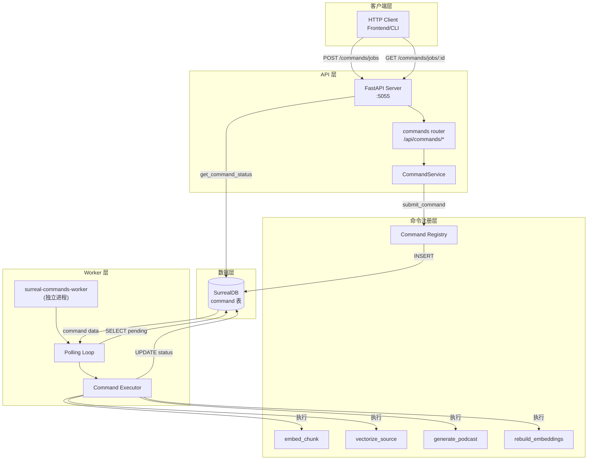

### 2.2 进程模型

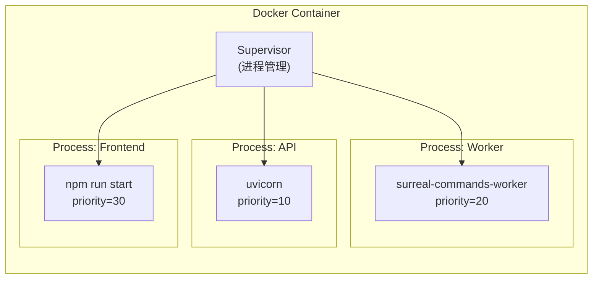

**supervisord.conf 配置**:
```ini
[program:worker]
command=uv run surreal-commands-worker --import-modules commands
stdout_logfile=/dev/stdout
stderr_logfile=/dev/stderr
autorestart=true
priority=20
autostart=true
startsecs=3
```

---

## 3. 命令生命周期

### 3.1 完整生命周期时序图

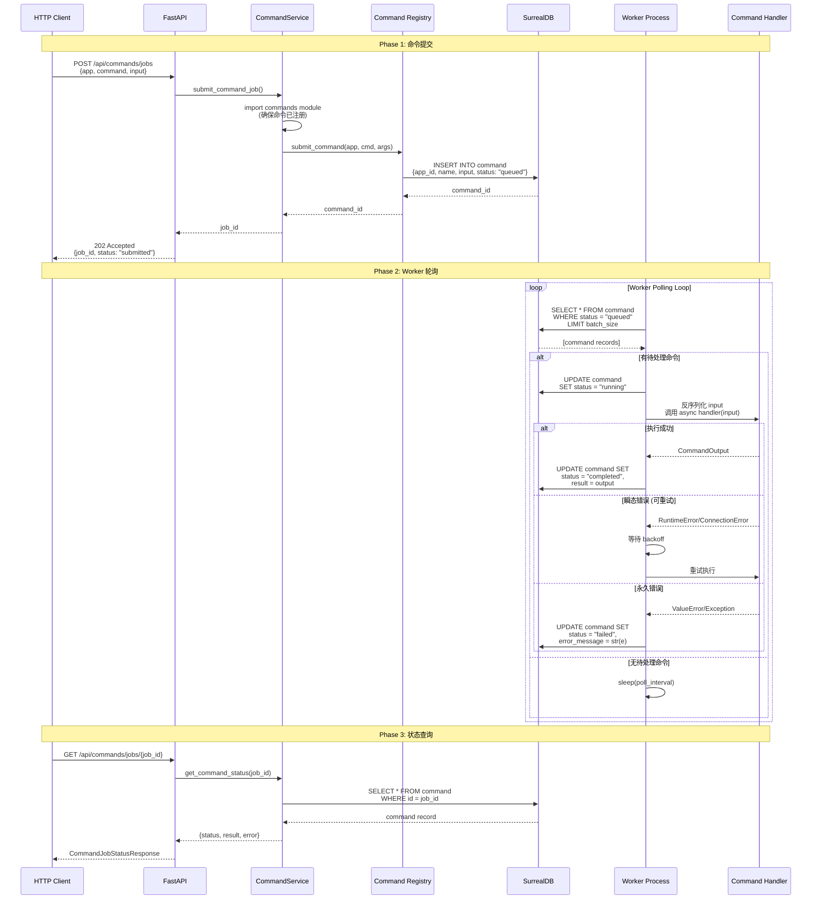

### 3.2 状态转换图

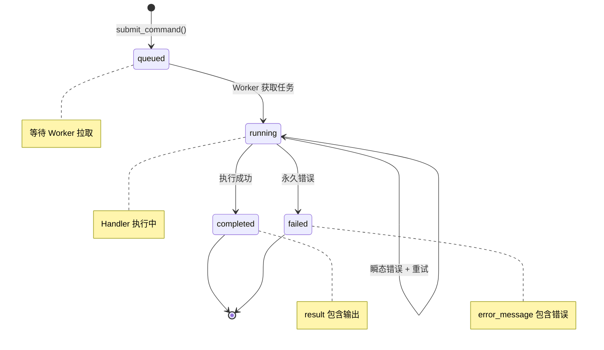

---

## 4. 命令定义与注册

### 4.1 命令模块结构

```
commands/
├── __init__.py              # 导出所有命令
├── embedding_commands.py    # 嵌入相关命令
├── podcast_commands.py      # 播客生成命令
├── source_commands.py       # 源处理命令
└── example_commands.py      # 示例命令
```

### 4.2 命令定义模式

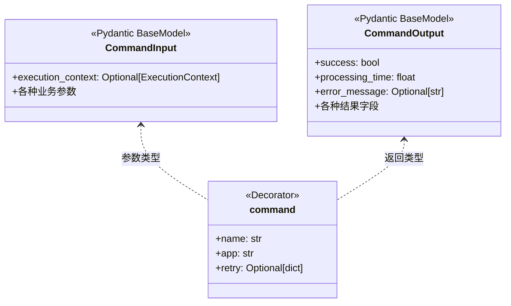

**代码示例** (`commands/embedding_commands.py`):

```python
from surreal_commands import command, CommandInput, CommandOutput

# 1. 定义输入模型
class EmbedChunkInput(CommandInput):
    source_id: str
    chunk_index: int
    chunk_text: str

# 2. 定义输出模型
class EmbedChunkOutput(CommandOutput):
    success: bool
    source_id: str
    chunk_index: int
    error_message: Optional[str] = None

# 3. 使用 @command 装饰器注册
@command(
    "embed_chunk",           # 命令名称
    app="open_notebook",     # 应用命名空间
    retry={                  # 重试配置
        "max_attempts": 5,
        "wait_strategy": "exponential_jitter",
        "wait_min": 1,
        "wait_max": 30,
        "retry_on": [RuntimeError, ConnectionError, TimeoutError],
    },
)
async def embed_chunk_command(input_data: EmbedChunkInput) -> EmbedChunkOutput:
    """处理单个文本块的嵌入"""
    try:
        # 业务逻辑
        embedding = await model.aembed([input_data.chunk_text])
        await repo_query("CREATE source_embedding CONTENT {...}")

        return EmbedChunkOutput(
            success=True,
            source_id=input_data.source_id,
            chunk_index=input_data.chunk_index,
        )
    except RuntimeError:
        # 瞬态错误：重新抛出以触发重试
        raise
    except Exception as e:
        # 永久错误：返回失败结果
        return EmbedChunkOutput(
            success=False,
            source_id=input_data.source_id,
            chunk_index=input_data.chunk_index,
            error_message=str(e),
        )
```

### 4.3 已注册命令列表

| 命令名称 | 用途 | 重试策略 |
|----------|------|----------|
| `embed_single_item` | 嵌入单个项目（source/note/insight） | 默认 |
| `embed_chunk` | 嵌入单个文本块 | 5次，指数退避+抖动 |
| `vectorize_source` | 编排源文档向量化 | 禁用 (retry=None) |
| `rebuild_embeddings` | 批量重建嵌入 | 禁用 (retry=None) |
| `generate_podcast` | 生成播客 | 默认 |
| `process_source` | 处理源内容 | 默认 |

---

## 5. Worker 执行机制

### 5.1 Worker 启动流程

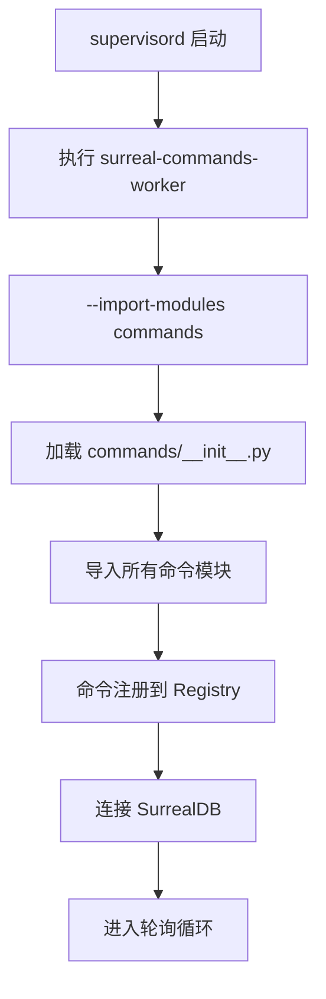

### 5.2 轮询与执行流程

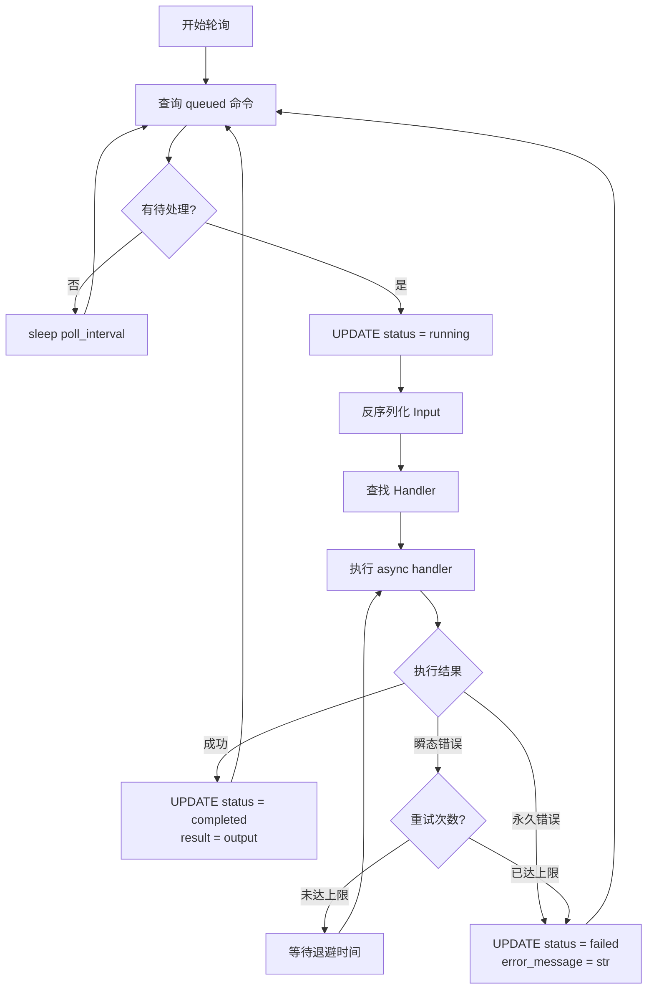

### 5.3 并发控制

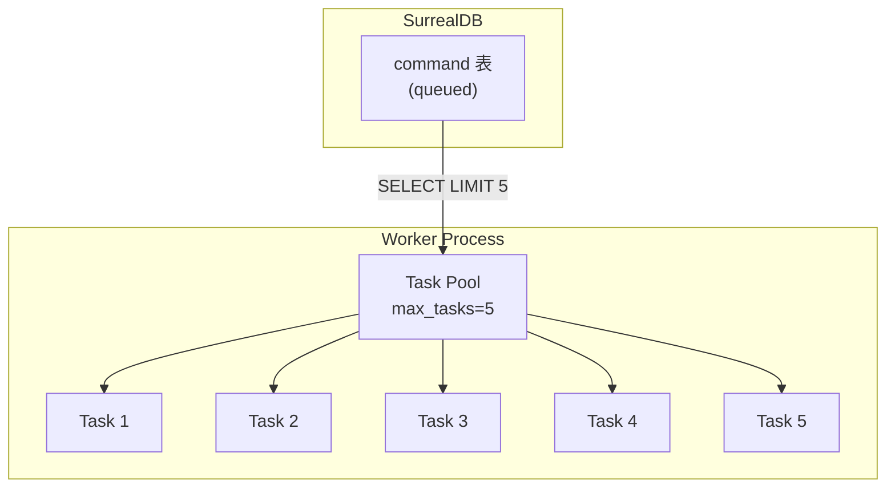

**环境变量配置**:
```bash
# Worker 并发任务数
SURREAL_COMMANDS_MAX_TASKS=5

# 轮询间隔（秒）
SURREAL_COMMANDS_POLL_INTERVAL=1
```

---

## 6. 重试机制详解

### 6.1 重试策略类型

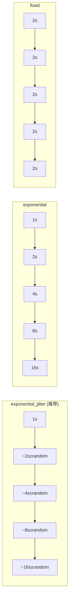

### 6.2 重试配置选项

| 参数 | 类型 | 默认值 | 说明 |
|------|------|--------|------|
| `max_attempts` | int | 3 | 最大重试次数 |
| `wait_strategy` | str | exponential_jitter | 退避策略 |
| `wait_min` | int | 1 | 最小等待秒数 |
| `wait_max` | int | 30 | 最大等待秒数 |
| `retry_on` | List[Exception] | [] | 触发重试的异常类型 |

### 6.3 异常处理模式

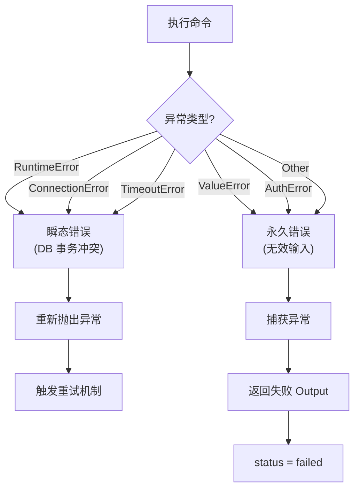

**代码示例**:
```python
try:
    # 可能失败的操作
    await repo_query("CREATE ...")
except RuntimeError:
    # 瞬态错误：重新抛出以触发重试
    logger.warning("Transaction conflict - will be retried")
    raise
except (ConnectionError, TimeoutError) as e:
    # 网络/超时错误：重新抛出以触发重试
    logger.warning(f"Network error ({type(e).__name__}) - will be retried")
    raise
except ValueError as e:
    # 永久错误：返回失败结果，不重试
    return Output(success=False, error_message=str(e))
```

### 6.4 全局重试配置

```bash
# .env 文件

# 启用/禁用重试（默认 true）
SURREAL_COMMANDS_RETRY_ENABLED=true

# 最大重试次数（默认 3）
SURREAL_COMMANDS_RETRY_MAX_ATTEMPTS=3

# 退避策略（默认 exponential_jitter）
SURREAL_COMMANDS_RETRY_WAIT_STRATEGY=exponential_jitter

# 最小等待时间（秒，默认 1）
SURREAL_COMMANDS_RETRY_WAIT_MIN=1

# 最大等待时间（秒，默认 30）
SURREAL_COMMANDS_RETRY_WAIT_MAX=30
```

---

## 7. 数据库交互

### 7.1 Command 表结构

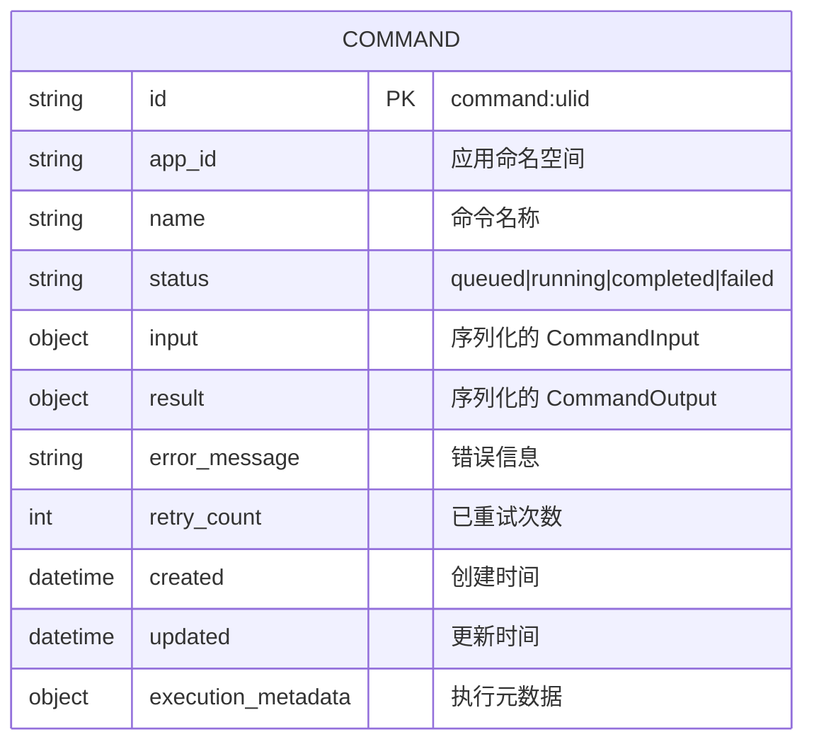

### 7.2 关联引用

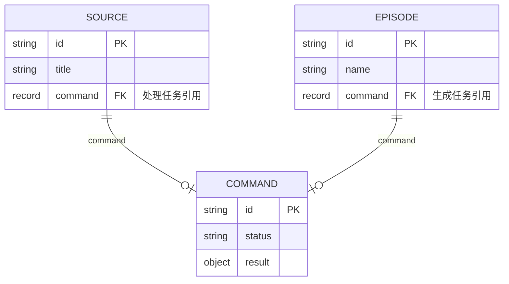

**Domain Model 关联** (`open_notebook/domain/notebook.py`):

```python
class Source(ObjectModel):
    command: Optional[Union[str, RecordID]] = Field(
        default=None,
        description="Link to surreal-commands processing job"
    )

    async def get_status(self) -> Optional[str]:
        """通过 command 获取处理状态"""
        if not self.command:
            return None
        status = await get_command_status(str(self.command))
        return status.status if status else "unknown"

    async def vectorize(self) -> str:
        """提交向量化任务"""
        command_id = submit_command(
            "open_notebook",
            "vectorize_source",
            {"source_id": str(self.id)}
        )
        return str(command_id)
```

### 7.3 数据库操作示例

**提交命令**:
```python
# surreal-commands 内部执行
INSERT INTO command {
    app_id: "open_notebook",
    name: "embed_chunk",
    status: "queued",
    input: {
        source_id: "source:abc123",
        chunk_index: 0,
        chunk_text: "..."
    },
    created: time::now(),
    updated: time::now()
}
```

**Worker 查询待处理命令**:
```sql
SELECT * FROM command
WHERE status = "queued"
ORDER BY created ASC
LIMIT 5
```

**更新状态**:
```sql
-- 开始执行
UPDATE command:xyz SET
    status = "running",
    updated = time::now()

-- 执行完成
UPDATE command:xyz SET
    status = "completed",
    result = {...},
    updated = time::now()

-- 执行失败
UPDATE command:xyz SET
    status = "failed",
    error_message = "...",
    updated = time::now()
```

---

## 8. API 接口

### 8.1 提交命令

```http
POST /api/commands/jobs
Content-Type: application/json

{
    "app": "open_notebook",
    "command": "embed_chunk",
    "input": {
        "source_id": "source:abc123",
        "chunk_index": 0,
        "chunk_text": "Hello world"
    }
}
```

**响应**:
```json
{
    "job_id": "command:01HQ...",
    "status": "submitted",
    "message": "Command 'embed_chunk' submitted successfully"
}
```

### 8.2 查询状态

```http
GET /api/commands/jobs/{job_id}
```

**响应**:
```json
{
    "job_id": "command:01HQ...",
    "status": "completed",
    "result": {
        "success": true,
        "source_id": "source:abc123",
        "chunk_index": 0
    },
    "error_message": null,
    "created": "2024-01-15T10:30:00Z",
    "updated": "2024-01-15T10:30:05Z",
    "progress": null
}
```

### 8.3 调试注册表

```http
GET /api/commands/registry/debug
```

**响应**:
```json
{
    "total_commands": 6,
    "commands_by_app": {
        "open_notebook": [
            "embed_single_item",
            "embed_chunk",
            "vectorize_source",
            "rebuild_embeddings",
            "generate_podcast",
            "process_source"
        ]
    }
}
```

---

## 9. 编排模式

### 9.1 扇出模式（Fan-out）

`vectorize_source` 命令展示了如何将一个大任务分解为多个小任务：

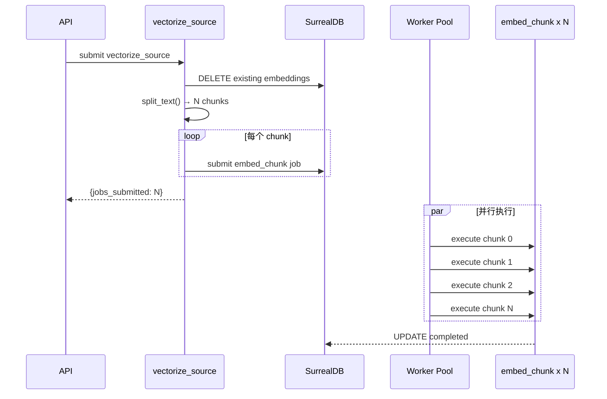

**代码实现** (`commands/embedding_commands.py:291`):

```python
@command("vectorize_source", app="open_notebook", retry=None)
async def vectorize_source_command(input_data: VectorizeSourceInput):
    # 1. 加载源文档
    source = await Source.get(input_data.source_id)

    # 2. 删除现有嵌入（幂等性）
    await repo_query("DELETE source_embedding WHERE source = $source_id", {...})

    # 3. 分割文本
    chunks = split_text(source.full_text)

    # 4. 为每个块提交独立任务
    for idx, chunk_text in enumerate(chunks):
        submit_command(
            "open_notebook",
            "embed_chunk",
            {
                "source_id": input_data.source_id,
                "chunk_index": idx,
                "chunk_text": chunk_text,
            }
        )

    # 5. 立即返回（任务在后台执行）
    return VectorizeSourceOutput(
        success=True,
        total_chunks=len(chunks),
        jobs_submitted=len(chunks),
    )
```

### 9.2 为什么编排命令禁用重试？

```python
@command("vectorize_source", app="open_notebook", retry=None)
```

| 原因 | 说明 |
|------|------|
| **快速失败** | 编排错误应立即可见 |
| **子任务有自己的重试** | embed_chunk 有独立的重试逻辑 |
| **避免重复提交** | 重试可能导致任务重复提交 |
| **调试友好** | 立即报错便于定位问题 |

---

## 10. 监控与调试

### 10.1 日志输出

```
# Worker 日志示例
INFO  Starting vectorization orchestration for source source:abc123
INFO  Deleting existing embeddings for source source:abc123
INFO  Split into 42 chunks
INFO  Submitting 42 chunk jobs to worker queue
INFO  Submitted 10/42 chunk jobs
INFO  Submitted 20/42 chunk jobs
INFO  Submitted 30/42 chunk jobs
INFO  Submitted 40/42 chunk jobs
INFO  Vectorization orchestration complete: 42/42 jobs submitted in 1.23s

# 重试日志
WARN  Transaction conflict for chunk 15 - will be retried by retry mechanism
INFO  [Retry] Attempt 2/5 for embed_chunk, waiting 2.3s
INFO  Successfully embedded chunk 15
```

### 10.2 状态轮询模式

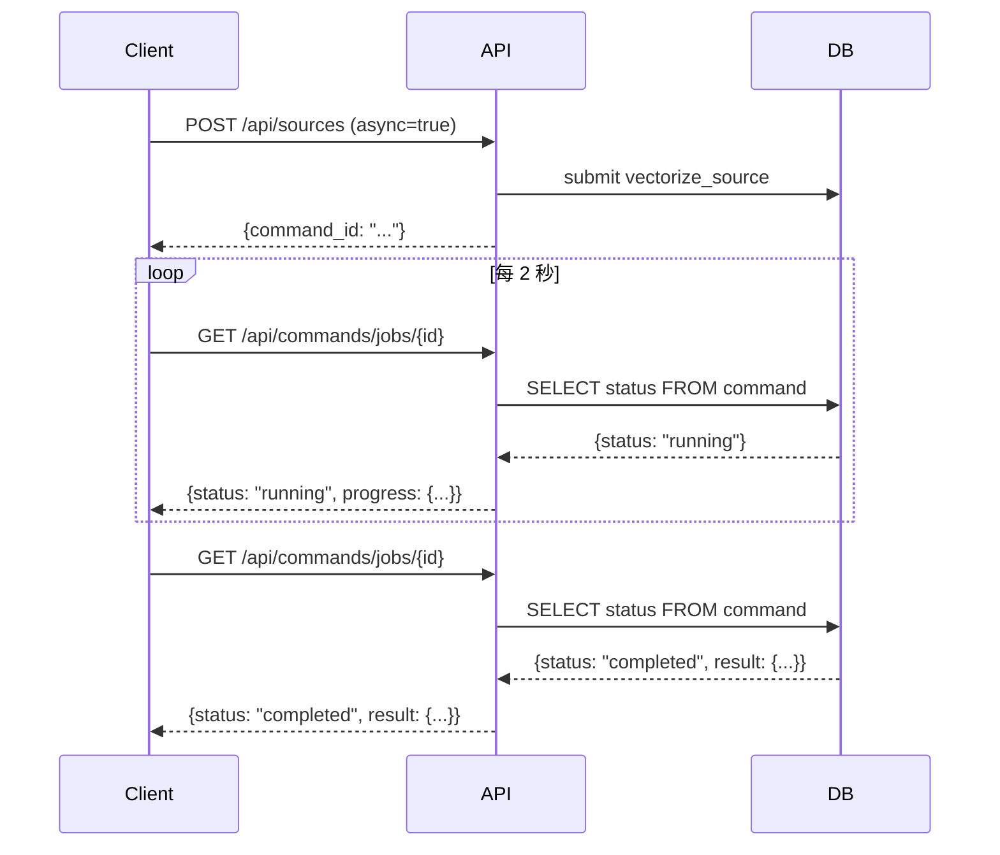

### 10.3 常见问题排查

| 问题 | 原因 | 解决方案 |
|------|------|----------|
| 任务卡在 queued | Worker 未启动 | 检查 supervisord 状态 |
| 大量事务冲突 | 并发过高 | 降低 MAX_TASKS |
| 重试耗尽 | 持续瞬态错误 | 增加 max_attempts 或 wait_max |
| 命令未注册 | 模块未导入 | 检查 --import-modules |

---

## 11. 总结

### 11.1 核心要点

1. **基于轮询的队列模式**：Worker 主动从 SurrealDB 拉取任务
2. **Pydantic 序列化**：Input/Output 模型自动序列化
3. **装饰器注册**：`@command()` 装饰器注册到全局 Registry
4. **可配置重试**：支持多种退避策略和异常过滤
5. **编排模式**：大任务可分解为多个小任务并行执行

### 11.2 最佳实践

| 实践 | 说明 |
|------|------|
| 使用 exponential_jitter | 避免雷群效应 |
| 区分瞬态/永久错误 | 瞬态重新抛出，永久返回失败 |
| 编排命令禁用重试 | 快速失败，子任务自己重试 |
| 关联 Domain Model | Source/Episode 存储 command 引用 |
| 监控重试率 | 高重试率说明需要调整配置 |

### 11.3 架构优势

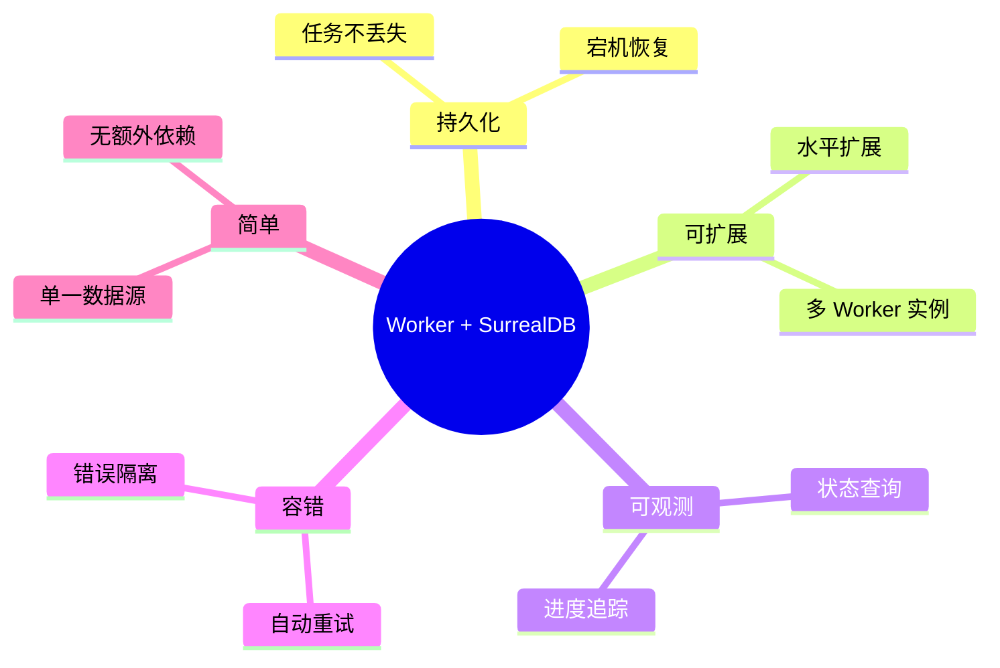
